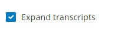

```table-of-contents

```

## Overview
This **genomic viewer** app has been developed to allow the visualization of multi-omics data of several kind. It has been implemented in **[[R]]** using **[[Shiny]]** and [[Plotgardener for flexible genomic screen generation]] packages.  The application allows to generate and export genomic view plots as well as download tables with datasets on selected genomic regions and perform some basic statistics and additional plots providing an overview of the input data. 


## Input data
The following section will describe which types of input datasets accepts the **Genomic viewer** app, how to prepare and provide them.
### Reference genome 
At the moment the **Genomic viewer** app is set up just for the **[GRCh38 (hg38)](https://www.ncbi.nlm.nih.gov/datasets/genome/GCF_000001405.26/)**  version of the human genome. However it can potentially be adapted to any other reference genome for which [Txdb annotation](https://bioconductor.org/packages/3.21/data/annotation/) R package is available.

#### Required files for genome annotation
The **[Plotgardener](https://phanstiellab.github.io/plotgardener/index.html)** function that is employed to generate the genomic view plot uses [Txdb annotation](https://bioconductor.org/packages/3.21/data/annotation/) package to plot the genomic features like the **Genomic label**, **Gene track** and names, **Expanded transcripts** isoforms and the **Chromosome ideogram**.

However, **additional files** must be also provided depending on the intended reference genome: 

##### Chromosome lengths and centromeres position

A .txt or .tsv file that contains the information about **chromosome name**, **centromere start**, **centromere end**, **chromosome length** and **order** to which chromosomes must be displayed.

The original file with such information can be retrieved from UCSC portal. For example the file for  **[GRCh38 (hg38)](https://www.ncbi.nlm.nih.gov/datasets/genome/GCF_000001405.26/)** can be downloaded here:   https://hgdownload.soe.ucsc.edu/goldenPath/hg38/database/. This file contains several bins for centromeres that can be merged to obtain the file table using the script *[hg38_centromeres.rmd](<C:/Users/sarlago/Documents/R scripts/Shiny/ShinyLoadYML/ShinyApps/ShinyApps_hover/hg38_centromeres.rmd>)*

This file is used in the app to store chromosomes coordinates which are needed to: 
i) **limit the zoom area** based on the selected chromosome length ([[#Zoom-in and out]]);
ii) plotting whole chromosome regions selected by the user from the **Choose chromosome** right panel ([[#Chromosome hover]]).

```
chr	cen.start	cen.end	chr.len	order
chr1	122026459	124932724	248956422	1
chr2	92188145	94090557	242193529	2
chr3	90772458	93655574	198295559	3
chr4	49712061	51743951	190214555	4
chr5	46485900	50059807	181538259	5
chr6	58553888	59829934	170805979	6
chr7	58169653	61528020	159345973	7
chr8	44033744	45877265	145138636	8
chr9	43389635	45518558	138394717	9
chr10	39686682	41593521	133797422	10
chr11	51078348	54425074	135086622	11
chr12	34769407	37185252	133275309	12
chr13	16000000	18051248	114364328	13
```

##### HGNC genes symbol and coordinates

A .bed file that contains the information about chromosome, start, end, strand and the HGNC symbol or any other gene nomenclature desired by the user to be visualized for the gene search option. This file is used instead for allowing the **[[#Search by gene]]** option available in the **Choose chromosome** right panel.
The file should match the **reference genome version** on which all the tracks are annotated, it can be obtained through several sources, one option is to download the information from [**UCSC Table Browser**](https://genome.ucsc.edu/cgi-bin/hgTables), or in alternative a script is provided to directly retrieve the information from **[biomart](https://bioconductor.org/packages/release/bioc/manuals/biomaRt/man/biomaRt.pdf)**, arrange the data in the correct format and output the file. The script *[get_hgnc_symbol_hg38.rmd](<file:///C:/Users/sarlago/Documents/R scripts/Shiny/ShinyLoadYML/ShinyApps/ShinyApps_hover/get_hgnc_symbol_hg38.rmd>)* set for **[GRCh38 (hg38)](https://www.ncbi.nlm.nih.gov/datasets/genome/GCF_000001405.26/)** is already provided together with the corresponding *[hg38_hgnc_symbol_cleaned.bed](<C:/Users/sarlago/Documents/R scripts/Shiny/ShinyLoadYML/ShinyApps/ShinyApps_hover/hg38_hgnc_symbol_cleaned.bed>)* file. 
Here is a preview of how the file structure should be:

```
chromosome_name	start_position	end_position	strand	hgnc_symbol
19	58345178	58353492	-1	A1BG
15	28506625	28508808	-1	ABCB10P4
16	32726615	32729537	-1	ABHD17AP7
16	33140850	33143797	1	ABHD17AP9
10	26746593	26861087	-1	ABI1
8	18088569	18089687	-1	ABRAXAS1P2
17	63507056	63519806	1	ACE3P
20	45841721	45857405	-1	ACOT8
10	88932390	88940820	1	ACTA2-AS1
3	180820544	180821612	1	ACTBP16
1	77773865	77774864	-1	ACTG1P21
```

### Tracks data
The following section will describe the type of datasets that **Genomic viewer** accepts and the type of tracks that it can use for plotting.
#### HiC and 3D contact matrices
3D contacts files, like HiC, stored in [hic file format](https://genome.ucsc.edu/goldenpath/help/hic.html). These is a binary format allowing for fast access to contact matrix heatmaps and is used for displaying chromatin conformation data in a browser.
#### 3D contacts arches bedpe
3D contacts can be represented not only as a heatmap or matrix, but as well as arches that join two distal genomic regions that are found in contact. This type of information is stored in the [.bedpe file format](https://bedtools.readthedocs.io/en/latest/content/general-usage.html#bedpe-format).
#### ChIP-seq, ATAC-seq, RNA-seq or any other bigWig 
Most of the 2D NGS datasets are normally stored in bigWig file formats, that are indexed binary files allowing the fast access of selected portions of the file corresponding to a browsed genomic region. The most common data types that can be loaded through a [bigWig file](https://genome.ucsc.edu/goldenpath/help/bigWig.html) are ChIP-seq, CUT&Tag, ATAC-seq, RNA-seq datasets.
#### Peaks bed 
[Bed files](https://www.ensembl.org/info/website/upload/bed.html) are normally used to store genomic ranges annotations, which can be for instance ChIP-seq or ATAC-seq peaks. Bed files con contain a variable number of columns with essential and optional information. For the purposes of this **Genomic viewer** only three tab separated fields are strictly necessary: **chromosome name**, **start**, **end**. As in the example below:

```
chr1  213941196  213942363
chr1  213942363  213943530
chr1  213943530  213944697
```
#### Categorical bed 
In addition to the standard .bed file, **Genomic viewer** also accepts categorical .bed which are structured as the [[#Peaks bed]] but have an additional required column assigning the corresponding genomic range to a category. In addition, categorical bed columns are names, as in the example below. Categorical bed can be used for example to classify peaks or functional genomic elements. For instance, several **functional elements** coordinates can be downloaded from [**UCSC Table Browser**](https://genome.ucsc.edu/cgi-bin/hgTables) and arranged in a single categorical bed file through the script [*generate_categorical_bed.Rmd](<file:///C:/Users/sarlago/Documents/R scripts/Shiny/ShinyLoadYML/ShinyApps/ShinyApps_hover/generate_categorical_bed.Rmd>)*. The resulting file (*[regulatory_elements_hg38.bed](<file:///C:/Users/sarlago/Documents/R scripts/Shiny/ShinyLoadYML/ShinyApps/ShinyApps_hover/regulatory_elements_hg38.bed>))* looks like this:

```
chr	start	end	category
chr1	155188536	155192004	h38_CpGIslands
chr1	2226773	2229734	h38_CpGIslands
chr1	36306229	36307408	h38_CpGIslands
chr1	47708822	47710847	h38_CpGIslands
chr1	53737729	53739637	h38_CpGIslands
chr1	101302963	101302972	h38_TSSpeaks
chr1	101304214	101304218	h38_TSSpeaks
```

Note that a same genomic range can belong to two different categories, in this case the entry must be repeated two times, with a single value in the category field.
#### GWAS summary statistics
**Genome Wide Association Studies** datasets can be plotted as Manhattan plots starting from GWAS statistics files. The [**GWAS Catalog**](https://www.ebi.ac.uk/gwas/) official database for store this type of data has recently updated and uniformed the structure of the deposited **summary statistics** file format. These are normally stored as gzipped .tsv files since contain huge amount of data. 
To generate a **Manhattan plot** through  **Genomic viewer** there are four required fields, which contain information about **chromosome name**, **position**, **p-value** and **SNP id**. These fields must be tab separated and names as in the example below:

```
chrom   pos         p       snp 
chr1	162766673	3.1e-01	rs1000050		
chr1	157285606	1.1e-02	rs1000073	
chr1	94701276	4.5e-01	rs1000075		
chr1	66392232	3.3e-01	rs1000085	
chr1	62967045	5.3e-01	rs1000127	
chr1	205536349	6.0e-01	rs1000312		
```

Any number of additional tab separated fields can be optionally added with no restriction in their name. By starting from the [**GWAS Catalog**](https://www.ebi.ac.uk/gwas/) summary statistics format, a file which is organized as required by **Genomic viewer** can be arranged using the script *[GWAS_data_organization_for_plotgardener.Rmd](<file:///C:/Users/sarlago/Documents/R scripts/Shiny/ShinyLoadYML/ShinyApps/ShinyApps_hover/GWAS_data_organization_for_plotgardener.Rmd>)*. Based on the user choice, this script allows to rearrange the GWAS summary statistics and export a properly organized file either in:
i) a **short version** with just the minimal required columns;
ii) an **extended version** with the minimal required columns correctly names, plus all the other original fields.
### How to provide input datasets

The following section will describe how to provide the desired input datasets for being plotted in the **Genomic viewer**.
#### Configuration file
To allow users to provide locally saved dataset to the **genomic viewer** without an heavy graphical interface, an **[[R configuration files (YAML)]]** has been set up. The configuration file (*[Shiny_wzoom_config_hover.yml](<file:///C:/Users/sarlago/Documents/R scripts/Shiny/ShinyLoadYML/ShinyApps/ShinyApps_hover/Shiny_wzoom_config_hover.yml>)*) is structured as shown below and allows the user to load any number of datasets for all the accepted data types. Note that when some of the specified entries is absent the corresponding field must be filled with an empty string " " or vector '[""]' as specified in the file comments.

```yml
---

default:

    # Set here the parameters related to the input files path and extensions
  # Data directory
  data.dir: "local/path/to/files/folder/"
  # bigWig directory and files final pattern or complete name (can correspond to one or more tracks), ordered file name to visualize. If empty type " " or [""] in names.
  bw.dir: "GSE212908_RAW_ATAC_bigwig"
  bw.ext: "treat_pileup.bw"
  bw.names: ["Kidney cortex 12", "Kidney cortex 15"]
  # bedpe directory and files final pattern, ordered file name to visualize. If empty type " " or [""] in names.
  bedpe.dir: "GSE212910_RAW_HiC_bedpe"
  bedpe.ext: "GSM6560960_mustache_0.1_0.2_out.diffloops_in_cortex_2.bedpe"
  bedpe.names: ["HiC arches"]
  # bed directory and files final pattern, ordered file name to visualize. If empty type " " or [""] in names.
  bed.dir: "GSE212908_ATAC_peaks"
  bed.ext: "GSE212908_RAM012_013_015_peak_masterlist.bed"
  bed.names: ["ATAC peaks"]
  # hic directory and files final pattern, ordered file name to visualize. If empty type " " or [""] in names.
  hic.dir: "GSE212910_RAW_HiC"
  hic.ext: "GSM7749626_Cortex_partitioned_donor5_DM.hic"
  hic.names: ["HiC cortex"]
  # GWAS directory and files final pattern, ordered file name to visualize. If empty type " " or [""] in names.
  gwas.dir: "GWAScatalog_KidneyDisease"
  gwas.ext: "relocatedCol.tsv.gz"
  gwas.names: ["GWAS chronic kidney disease"]
  # categorical bed file.If empty type " " or [""] in names.
  cat.file: "regulatory_elements_hg38.bed"
  cat.names: ["Regulatory Elements"]
  # file with chromosomes and centromeres coordinates
  chrom.cen: "chrom_centromeres_hg38.txt"
  # file with desired genome genes hgnc symbol and coordinates
  genes.hgnc: "hg38_hgnc_symbol_cleaned.bed"
```


## Output results


## Structure of the Genomic viewer interface

In the following section the different panels of **Genomic viewer** tool are described. 

### Main panel overview
When the app is opened the main panel will display. The main panel is divided into **three navigation bars**. 

![[main_panel_wSections.jpg]]


1. **Left sidebar**: the left sidebar allows the user to set different options for the genomic region to be visualized: 

	- **Choosing the genomic range:** The used can select the *chromosome name* (accepted names for hg38 are 1-22, X, Y), *start coordinate* and *end coordinate*. These values can be selected in different way: by directly typing in the corresponding field, by selecting a whole chromosome or a specific gene from the [[#^f30e7c|right navigation bar]], or by zooming-in and out from the [[#^af61fe|central panel]].
	 ^f6fb72
	- **Select bigWig plots mode**: when there are bigWig tracks among the data files loaded by the user, one can choose if plotting bigWig signal as *Profile*, *Heatmap* or both *Profile and Heatmap* by choosing the desired option from the drop down menu.
	
	![[select_bigwig_mode.jpg | center ]]
	
	- **GO button**: allows the user to initialize the plot with the selected options.
	 ^dbc4a3
	- **Save button**: the *Save* button allows the user to download the displayed plot relative to the visualized genomic region in pdf format. This is only working for the genomic view plot and not for the plots displayed in the *[[#Visualize basic statistics analysis for the loaded data|Stats tab]]*.
	
2. . **Central panel with plots and data**: the central panel is the most important. It allows the user to navigate across three different tabs: **Plot**, **Data** and **Stats**. ^af61fe

	![[navigation_tabs 5.jpg]]
	
	- **[[#Plot]]**: here is where the main output of the app is shown. All the data that were loaded by the user through the *[[#Configuration file]]* are plotted for the selected genomic region and according to the provided options. On the top left of the window, the exact coordinates of the displayed genomic regions are reported, and can be copy-pasted for external usage. The lowermost part of the window shows instead several options to **[[#Zoom-in and out]]**. 
	 - ![[Plot_tab_wSections.jpg]]
	 - 
	- **[[#Visualize raw data for the selected genomic range|Data]]**: 
	 - 
	- **[[#Visualize basic statistics analysis for the loaded data|Stats]]**:
	 - 
	 - 

3. **Right navigation bar**: this panel provides options for the automatic update of the genomic coordinates to visualize, as well as options to change the visualization mode for *[[#Categorical bed]] files* and the *[[#Required files for genome annotation|Gene annotation track]]*. 

	- **Choose chromosome hover**: the top of the panel displays an overview of all the chromosomes relative to the active reference genome (**[GRCh38 (hg38)](https://www.ncbi.nlm.nih.gov/datasets/genome/GCF_000001405.26/)** in the default case). This allows the user to easily select the coordinates of a whole chromosome for visualization of the loaded data tracks. By mouse hovering to single chromosomes in the plot a text is displayed below the graph indicating the corresponding chromosome name. By clicking on the chromosome in the plot the coordinates displayed in the [[#^f6fb72|left sidebar]] will automatically update and the **[[#Plot, Data and Stats tab|Plot tab]]** in the central window will update upon clicking the *[[#^dbc4a3|GO button]]*. ^f30e7c
	
![[choose_chromosome_hover.jpg]]

- **Search by gene**: the bottom of the panel displays a search menu in which the user can type gene names. The search box allows for autofill of the typed text with the matching gene names which the used can select from the displaying drop-down menu. By clicking on the corresponding gene name or typing in the complete name the coordinates displayed in the [[#^f6fb72|left sidebar]] will automatically update and the **[[#Plot, Data and Stats tab|Plot tab]]** in the central window will update upon clicking the *[[#^dbc4a3|GO button]]*. 

![[search_by_gene.jpg]]

- **Select categories to expand**: the bottom of the panel displays a selection menu relative to eventual *[[#Categorical bed]]* files loaded by the user. In this field options will be available in the case when categorical bed files are loaded. By selecting one or more of the available file names from this menu, the user will select to expand the view of the categories belonging to the corresponding track in the central plot. Categories expansion can be relevant when genomic ranges annotated to different categories overlap. In this case the can be plotted on different lines and separated through the categories expansion option.

![[expand_categories.jpg | center]]

- **Expand transcripts**: the lowermost option available from the right navigation panel allows to take action on the genome annotation track relative to the active reference genome. In the default visualization *Gene tracks* are collapsed. By checking the *Expand transcript* box genes annotations relative to the visualize genomic range will be expanded to visualize all the annotated transcripts.




## Usage

### Selecting the genomic region to visualize
#### Chromosome hover
#### Search by gene

#### Zoom-in and out

### Plot, Data and Stats tab
#### Plot
describe the behavior with the different types of tracks, i.e. gene tracks are plotted as density plots when regions larger than 10Mb are displayed to improve computing time and image readability. Binning resolution of matrix data is increased when too large region (how large) are displayed to improve computing speed, avoid too heavy images. On the contrary, when the visualize regions has high zoom which exceeds the minimum resolution of (x kb) the matrix will not be visualized because would have no sense to see just one pixel. For bigwigs and heatmaps the binning is as well increase (how much?) when regions larger than (X) are displayed for speed reasons and image manipulation. 

#### Genomic view plot of the selected genomic range

descrivere anche le opzioni che si hanno per modificare le tracce e.g. bigwig mode, categories expand and expand transcripts.

#### Visualize raw data for the selected genomic range

#### Visualize basic statistics analysis for the loaded data

### Downloading plots and data
