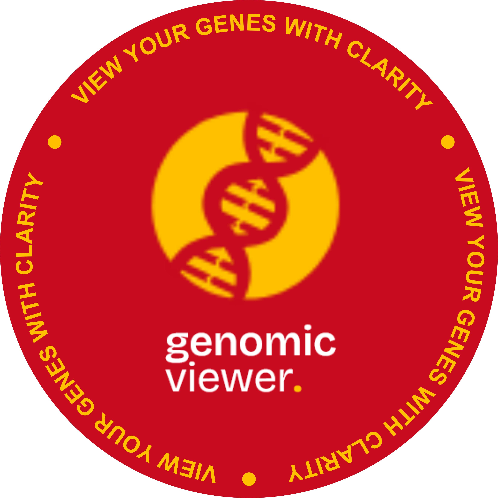
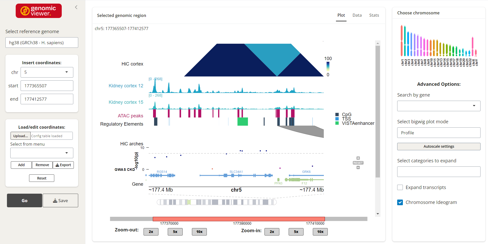
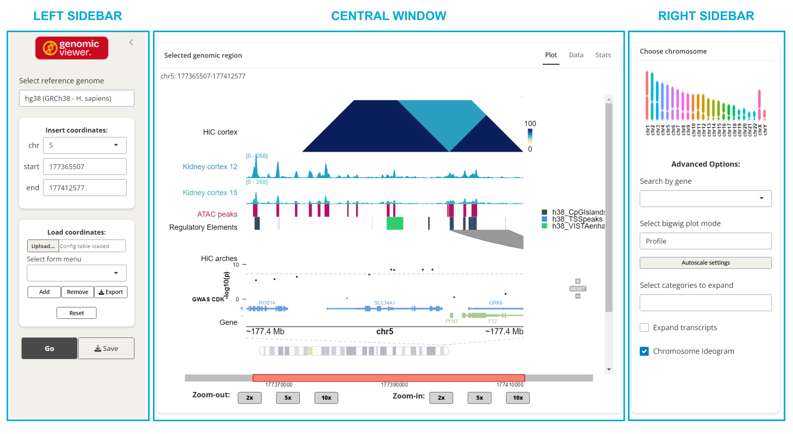
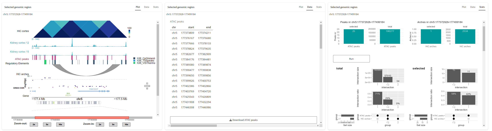

---
output:
  html_document: default
  pdf_document: default
---
---

# Genomic Viewer

**Version:** 1.0.0\
**Description:** Genomic Viewer is a cross-platform application for visualizing and analyzing genomic data hosted in a Docker container.

------------------------------------------------------------------------

## Table of Contents

&nbsp;

1.  [Overview](#overview)
2.  [System requirements](#system-requirements) 
3.  [Installation](#installation)
4.  [Getting Started](#getting-started)
5.  [Source Code](#source-code)

------------------------------------------------------------------------

## Overview

&nbsp;

***Genomic Viewer*** is a GUI application developed with the aim of providing a unique tool for the visualization and biological interpretation of Next Generation Sequencing (NGS) data, 
offering both qualitative and quantitative evaluations. It solves the necessity to employ multiple software for genomic data exploration, filtering and generation of 
publication-quality plots. ***Genomic Viewer*** is designed to be of easy access also for non-programmer users, works offline, allows sessions shareability and performs some basic 
analysis for data inspection.
  

------------------------------------------------------------------------

## System Requirements

Software and Hardware

#### **Operating System**

-   Windows 10 or higher
-   macOS 11 with Apple M1 ARM64 or higher 
-   Linux Debian-based or Red Hat-based distributions

#### **Hardware Recommendations**

-   Minimum RAM 4GB
-   Minimum disk space 12GB: 4GB Docker Desktop, 7.5GB Genomic Viewer Docker image, 350Mb Genomic Viewer Installer, plus space for user defined data to be loaded

------------------------------------------------------------------------

## Installation

Installation Instructions

Recommended actions for the user *before* installing ***Genomic Viewer*** and Step-by-step instructions on how to get the application running.
  

#### **Windows**
    
**Prerequisites:**

-   Install [Docker Desktop for Windows](https://docs.docker.com/desktop/setup/install/windows-install/).
-   Enable the Windows Subsystem for [Linux WSL2](https://learn.microsoft.com/en-us/windows/wsl/install) (optional, if not enabled ***Genomic Viewer installer*** will do it for you).
-   Download `genomicviewer-gui-installer` file for Windows from [GitHub](https://github.com/sarlago/Electron_GV_installer).

**Procedure:**

1. Extract the `windows-x64` installer file.
2. Start setup by double-click on `genomicviewer-gui-installer-1.0.0 Setup` file.
3. Follow the installer wizard instructions.
  

#### **macOS**

**Prerequisites:**

-   Install [Docker Desktop for macOS](https://docs.docker.com/desktop/setup/install/mac-install/).
-   Download `genomicviewer-gui-installer` file for macOS from [GitHub](https://github.com/sarlago/Electron_GV_installer).

**Procedure:**

1. Extract the `macos-arm64` installer file.
2. Start setup by double-click on `GenomicViewer.dmg` file.
3. Drag the `.app` bundle to the `Application` folder.
4. Follow the installer wizard instructions.
  

#### **Linux**

**Prerequisites:**

-   Install either [Docker Desktop for Linux](https://docs.docker.com/desktop/setup/install/linux/) or [Docker Engine](https://docs.docker.com/engine/install).  
    **Note:** Non-root users can still use docker if [rootless mode](https://docs.docker.com/engine/security/rootless/) is configured on their system.
-   Download `genomicviewer-gui-installer` file for Linux from [GitHub](https://github.com/sarlago/Electron_GV_installer). 
    **Note:** Linux installer provides both *.deb* package for *Debian-bases* distributions and *.rpm* package for *Red Hat-based* distributions. A self-contained app is also available for non-root users.
    
**Procedure:**  
***To install Genomic Viewer as a root user:***

1. Extract the `linux-64` installer file
2. Install the Genomic Viewer guided setup package by double-click on either `genomicviewer-gui-installer-1.0.0_amd64.deb` or `genomicviewer-gui-installer-1.0.0-1.x86_64.rpm` file based on your linux distribution
3. Launch the application setup by executing `genomicviewer-gui-installer-1.0.0_amd64` or `genomicviewer-gui-installer-1.0.0-1.x86_64` command in a terminal

***To install Genomic Viewer as a non-root user:***

1. Start installation from the self-contained app image `genomicviewer-gui-installer-x86_64.AppImage` by running `./genomicviewer-gui-installer-x86_64.AppImage` or `./genomicviewer-gui-installer-x86_64.AppImage --no-sandbox` based on your Linux Setup
2. Follow the installer wizard instructions

------------------------------------------------------------------------
  
## Getting Started

Quick Start

A short hands-on section showing a simple workflow.

<h5> **1. Configure and Load data** </h5>
Data and their annotation are loaded through a configuration file named `GenomicViewer_config.yml` which is automatically saved in the `/data` folder during ***Genomic Viewer*** installation in the user selected location. 
A default configuration file is pre-filled and ready-to-use with information relative to an example dataset retrieved from public data (accession numbers GEO: GSE212908, GSE212910, GAWS catalog: 26831199 and UCSC Table Browser Regulatory elements). 
**Note:** example data are restricted to **chr5** as tester lightweight sample.
For more details about how to fill the *Configuration file* see the [Configuration section](assets/genomicviewer-reference-manual.html #configuration).  
***Genomic Viewer*** determines the data type and label based on the configuration file entries. See [File Formats](assets/genomicviewer-reference-manual.html #file-formats) for information about the accepted data formats in the [Configuration section](#configuration).  
Additional configurations like track plots alternatives, transcript or gene label annotation and chromosome display are available from the graphical interface and are thoroughly described in the [Features and Usage section](assets/genomicviewer-reference-manual.html #features-and-usage).  
Make sure that the data you want to load are saved in the `/data` directory that was created upon ***GenomicViewer*** installation. Pay attention to load only data files with matched reference genome. 

<h5> **2. Launch Genomic Viewer** </h5>
Launch ***Genomic Viewer*** from the **GV** desktop icon that is created upon installation. 
After loading all the required R packages ***Genomic Viewer*** interface will open as a new tab in your default web browser.

<h5> **3. Select a reference genome** </h5>
***Genomic Viewer*** shows data aligned to the genomic coordinates of a selected reference genome. It is essential to choose the correct reference genome to avoid mislabeling of gene/transcript annotation tracks and coordinates.
Pay attention to load data tracks that are mapped to the same reference genome, and choose the reference accordingly.
When you first launch the ***Genomic Viewer*** application, it automatically loads the default reference genome (currently hg19). 
For instructions on changing to another reference genome, refer to *Reference Genomes* paragraph in the [Features and Usage section](./genomicviewer-reference-manual.html#features-and-usage).

<h5> **4. Navigate** </h5>
The genomic range to be visualized can be specified in different ways thanks to multiple navigation controls provided by ***Genomic Viewer*** graphical interface.
Among the available options there is the manual inserting of genomic coordinates, upload of predefined coordinate sets, navigation by gene name or entire chromosomes overview.
Zooming options also allow to adjust the view dynamically. Once the genomic screenshot is generate through the **Go button**, a chromosome ideogram will show the position and extent of the displayed region.
For more details about genomic navigation refer to the *Genomic Navigation* paragraph in the [Features and Usage section](./genomicviewer-reference-manual.html#features-and-usage).

<h5> **5. Explore datasets** </h5>
***Genomic Viewer*** provides three different navigation tabs named **Plot**, **Data** and **Stats**, allowing the user to: 
- Generate and visualize genomic screenshots of a selected region;
- Subset the original data to the visualized genomic range, having those available for external use; and 
- Obtain quantitative and descriptive information useful for the biological interpretation of the tracks.
 
Further description of each panel is available at the *Central Panels* in the [Features and Usage section](./genomicviewer-reference-manual.html#features-and-usage) paragraph.

<h5> **6. Export results and coordinates** </h5>
***Genomic Viewer*** allows to export and save different outputs generated during a working session:
- The visualized genomic screenshot can be exported preserving all the user-defined settings as publication-quality plot in different file formats through the **Save button**;
- A custom list of coordinates dynamically created during the working session can be exported and saved thanks to the options in the **Load coordinates** panel;
- Subset of the raw data matching the selected genomic region can be downloaded as individual files for the **Data** navigation panel. 

A more in detail description of these functions is reported in the [Features and Usage section](./genomicviewer-reference-manual.html#features-and-usage).

<h5> **7. Share your session** </h5>
The idea of providing all the input datasets through a configuration file starts from the need to have an way to restore and share working sessions among users and collaborators.
Importing a session created by a different user is as simple as copying the same configuration `GenomicViewer_config.yml` file within your own `/data` folder as long as you have access to the same data files.
Several configuration files can be stored separately to keep track of multiple working sessions. Just remember to check that the correct reference genome is selected upon starting the ***Genomic Viewer*** application from a previous session.

------------------------------------------------------------------------

User Interface Overview

Brief description of the ***Genomic Viewer*** graphical interface structure. 

<h5>**Main Window**</h5>

The main widow of ***Genomic Viewer*** application is structured to have two lateral sidebars with actionable options and tools and a larger central area which is meant to display the results.
It can be summerized into three sections:

- *Left sidebar*, with reference genome, coordinates selection and action buttons;
- *Right sidebar*, with interaction tool for entire chromosome plotting and other search and graphics advanced options; and
- *Central panel*, with three different navigation tabs allowing to display the ***Genomic Viewer*** outputs.

<h5> **Sidebars** </h5>

***Left sidebar:***
The left sidebar provides several functions for choosing the working reference genome and navigating through it.It is essential to select a reference genome that matches all the loaded data defined in the configuration file.
Next there are different options for either manually insert the coordinates to visualize or load them from a custom list. The list of saved coordinates can be modified dynamically and exported to reusing it in another session or sharing with other users.
The left sidebar is also where the *Go* and *Save* buttons are located, used to start the creation of the genomic view plot and to export it in different file formats. 

***Right sidebar***
The right sidebar provides advanced options for genomic navigation and graphical settings. It allows to pass to the tool the coordinates of entire chromosomes with a simple hover and click and to navigate to specific gene through gene name search.
It is fundamental to set first the correct reference genome, as the chromosomes and genes ID and coordinates change accordingly.
The graphical settings that can be controlled form the right sidebar are the bigwig profile tracks plotting mode, if the genomic label track will display genes or transcript isoforms and if to display or not the chromosome ideagram at the plot bottom.

<h5> **Central Navigation Panels** </h5>
The central area is the core of ***Genomic Viewer*** as it is where its outputs are displayed. It allows the user to navigate across three different panels showing respectively:
- The *Plot* relative to the selected genomic region displaying all the tracks that were loaded through the configuration file. A *zoom* action bar is also available to resize the image and adjust the genomic range around the
visualized range;
- A preview of the *Data* subset to the visualized genomic region with the possibility to download them;
- A list of plot that the user can be individually generated by the user to visualize some *Stats* relative to the loaded datasets.

Further details are available in the [Features and Usage section](#features-and-usage).
  

------------------------------------------------------------------------

Tutorial

A complete **Tutorial** showing a usage example with the ***Genomic Viewer*** built-in test data is described in the [Tutorial](./genomicviewer-reference-manual.html #tutorial) section of the reference manual.                                                                      

------------------------------------------------------------------------

## Source Code

***Genomic Viewer*** and its [Electron](https://www.electronjs.org/) built ***GUI installer*** source code are freely available through [GitHub](https://github.com/sarlago) under MIT Licence.

