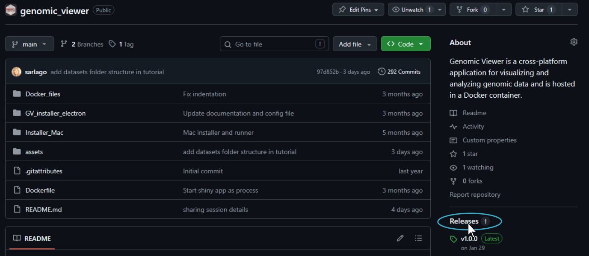
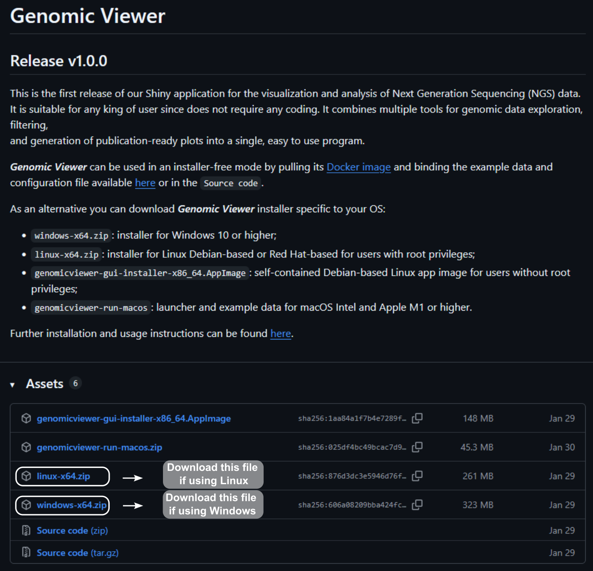
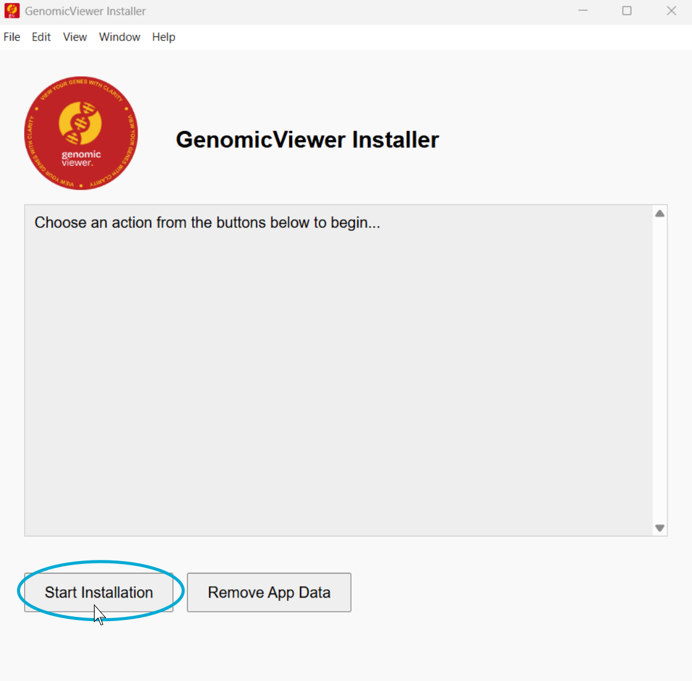
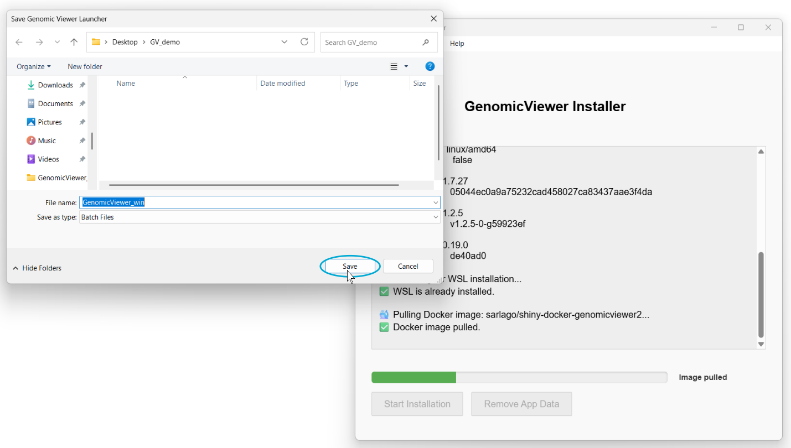

# Genomic Viewer Installation Wizard

**Version:** 1.0.0\
**Description:** Genomic Viewer is a cross-platform application for visualizing
and analyzing genomic data hosted in a Docker container.

------------------------------------------------------------------------

## Table of Contents

&nbsp;

1. [Detailed installation through installation wizard](#detailed-installation-through-installation-wizard)

------------------------------------------------------------------------

In the following you can find step-by-step instructions to install ***Genomic Viewer***.
If you encounter any problem, please report it by creating a 
[GitHub issue](https://docs.github.com/en/issues/tracking-your-work-with-issues/using-issues/creating-an-issue) 
or contacting us [directly](mailto:sara.lago@eurac.edu).

## Detailed installation through installation wizard

&nbsp;

1. Ensure you meet all the [prerequisites](README.md#installation) for a successful 
***Genomic Viewer (GV)*** installation. Here is a checklist:

  - Docker is installed.
  - WSL is enabled. 
  - You have downloaded ***GV*** release for Windows (see below).
  
  
2. Download ***GV*** installer from GitHub:

  i) Go to the [releases](https://github.com/EuracBiomedicalResearch/genomic_viewer/releases)
     page of the ***Genomic Viewer*** GitHub repository.
     
  
     
  ii) Under assets click on the installer file specific to your OS to start its download.
  
  
     

3. Launch installer wizard:
     

  i) Once download has completed, unzip the file by `right click > Extract all`.
       Go to `windows-x64 > squirrel.windows > x64` and double click on  
       `genomicviewer-gui-installer-1.0.0 Setup` to start the installation wizard.
       
  ii) Select `Start Installation` from the installation wizard and inspect the log 
      messages for any installation issue or required action. 
      
  
      
  iii) The installer will open a file explorer from which you can choose the directory 
     in which to save the demo data, configuration file and ***GV*** launcher script.
     
  
     
  iv) When installation is completed you can click on the `Finish` button to 
      close the installer wizard.
      
  
      
  vi) You can now start ***GV*** by double-click on its Desktop icon.
  
  
  

------------------------------------------------------------------------

