# Genomic Viewer Installation Guide

**Version:** 1.1.0
**Description:** Genomic Viewer is a cross-platform application for visualizing
and analyzing genomic data hosted in a Docker container.

------------------------------------------------------------------------

## Table of Contents

&nbsp;

1. [Windows](#windows)
2. [Linux](#linux)
3. [macOS](#macos)

------------------------------------------------------------------------

This is a guide with step-by-step instructions to install ***Genomic Viewer***.
If you encounter any problem, please report it by creating a
[GitHub issue](https://github.com/EuracBiomedicalResearch/genomic_viewer/issues)
or contacting us [directly](mailto:sara.lago@eurac.edu).

## Windows

&nbsp;

1. Ensure you meet all the [prerequisites](../README.md#installation) for
   ***Genomic Viewer*** installation. Here is a checklist:

  - Docker is installed. ✅
  - WSL2 is enabled. ✅
  - You have downloaded the latest ***Genomic Viewer*** release for your
    operating system (see below). ✅

2. Download ***Genomic Viewer*** installer from GitHub:

  i) Go to the [releases](https://github.com/EuracBiomedicalResearch/genomic_viewer/releases)
     page of the ***Genomic Viewer*** GitHub repository.

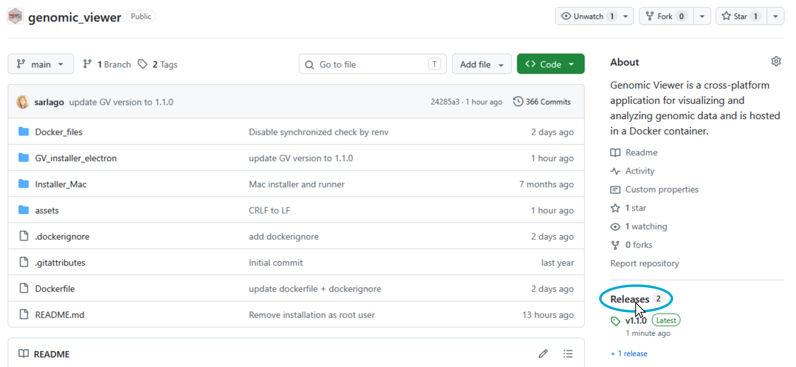
# Replace this with correct image once we have the new release!! Also, please do
not use black background in the images, this impedes reading text.

  ii) Under `Assets` choose the corresponding installer for Windows and start
      its download.

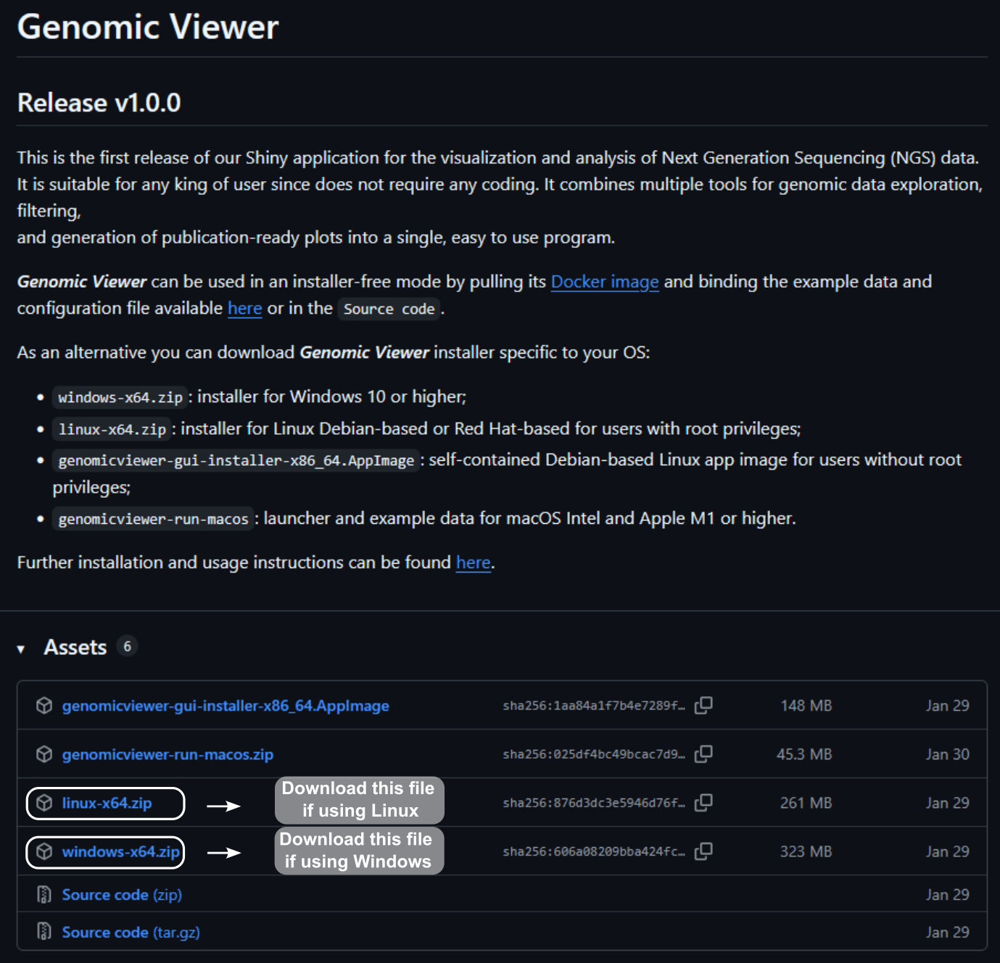 # Replace this with correct image once we have the new release!! Avoid black background.

3. Launch installer wizard:

  i) Once download has completed, unzip the file by `[right-click] > Extract all`.
     Go to `windows-x64` and double click on
     `genomicviewer-gui-installer-1.1.0 Setup` to start the installation wizard.
     If the installer does not start, right-click it and select `Run as administrator`.
     
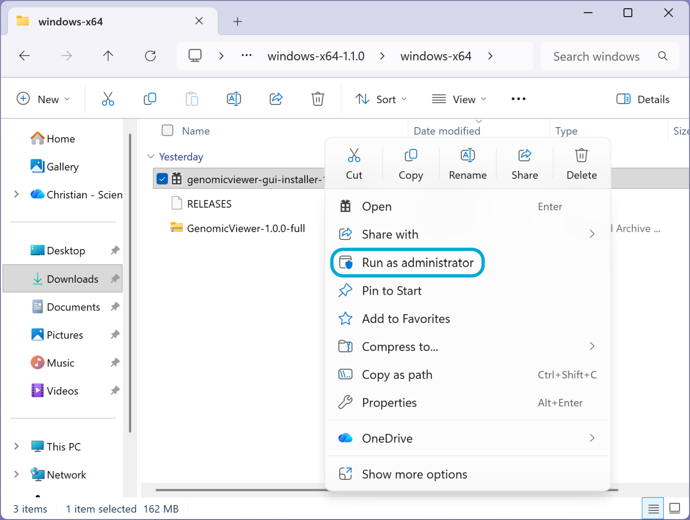

  ii) Select `Start Installation` from the installation wizard and inspect the
      log messages for any installation issue or required action.

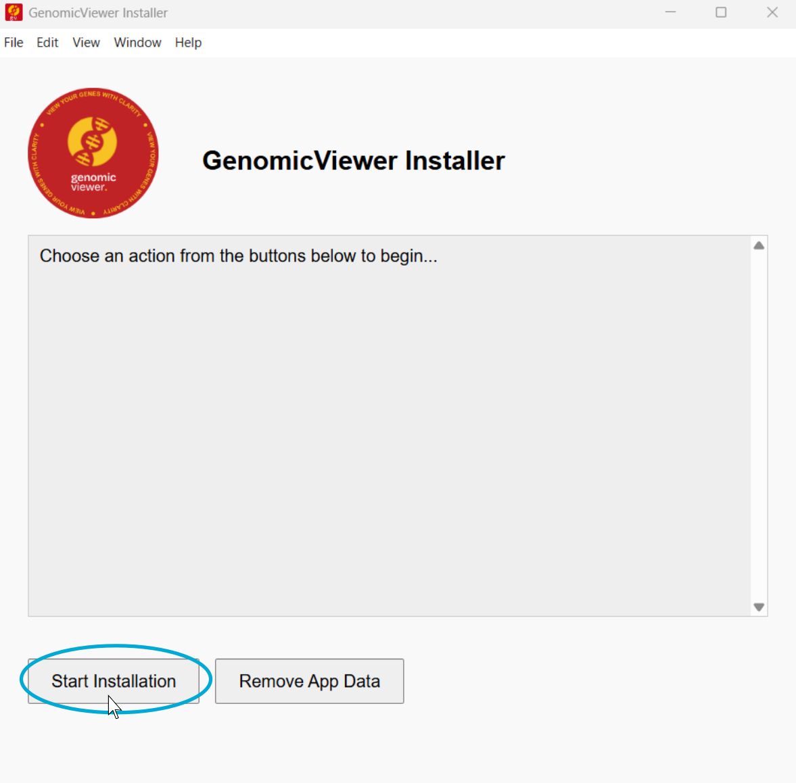

  iii) After a while (it pulls the Docker image first), the installer will open
       a file selection box. This will save the startup script for
       ***Genomic Viewer*** and the chosen directory will also determine the
       location of the accompanying data and the config file. Either choose an
       existing directory or create a new one.

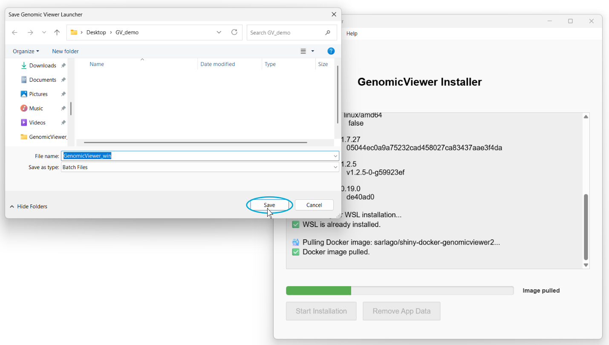

  iv) After completing the installation, click `Finish` to close the installer.

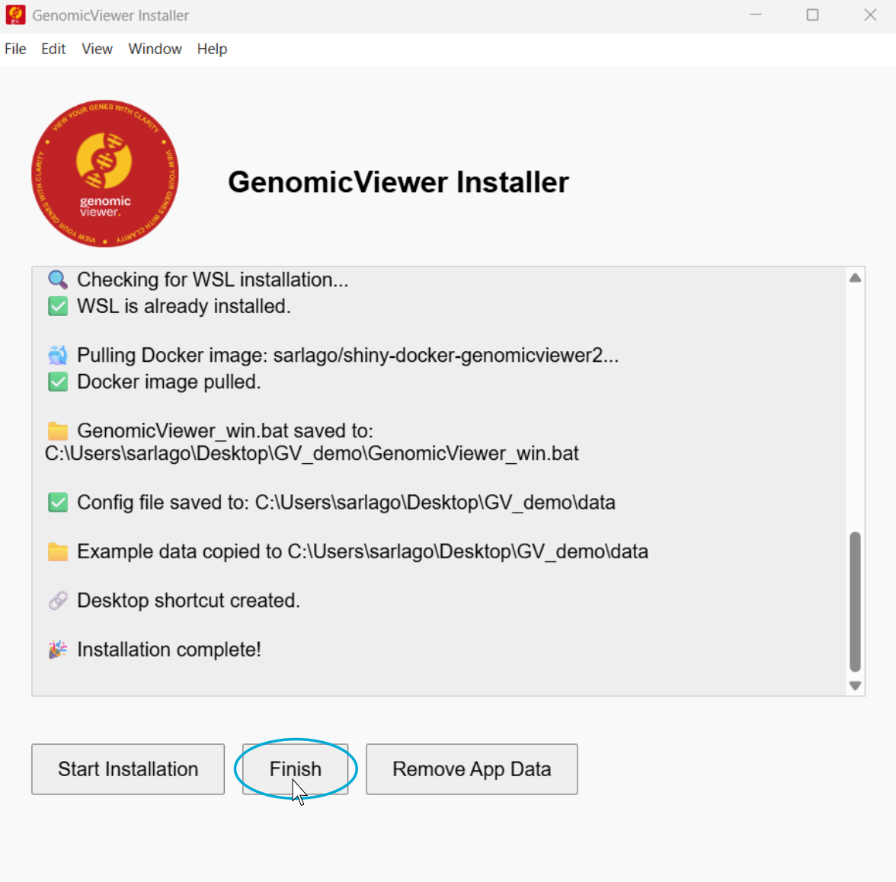

  v) ***Genomic Viewer*** is now ready to be started by double-clicking on the
      desktop icon.

  vi) Keep the installer file in case you want to remove the software later.

## Linux

&nbsp;

1. Ensure you meet all the [prerequisites](../README.md#installation) for
   ***Genomic Viewer*** installation. Here is a checklist:

  - Docker is installed. ✅

  - [Rootless mode](https://docs.docker.com/engine/security/rootless/) has been
    enabled by a sysadmin. ✅
    
  - You have downloaded the latest ***Genomic Viewer*** release for Linux
    (see below). ✅

2. Set up the Docker daemon such that it runs in your own namespace. This step
   is required only once, so if in the future you upgrade to a newer version of
   ***Genomic Viewer***, this step can be skipped. But for a first time ever
   installation, run
   
   `dockerd-rootless-setuptool.sh install`
   
   In case the script `dockerd-rootless-setuptool.sh` is not found, you can
   download this file from the docker web site and execute it:
   
   `curl -fsSL https://get.docker.com/rootless | sh`
   
   More details are given on Docker's 
   [rootless mode](https://docs.docker.com/engine/security/rootless/) page. 

3. Download ***Genomic Viewer*** installer from GitHub:

  i) Go to the [releases](https://github.com/EuracBiomedicalResearch/genomic_viewer/releases)
     page of the ***Genomic Viewer*** GitHub repository.

# Replace this with correct image once we have the new release!! Also, please do
not use black background in the images, this impedes reading text.

  ii) Under `Assets` download file `genomicviewer-gui-installer-x86_64.AppImage`.

 # Replace this with correct image once we have the new release!! Avoid black background. This image can be reused with Linux, yeah!

4. Install with the wizard:

  i) Start installer. Be sure the app image is executable (`chmod 755` command) 
     and run the installer with 
     
     `./genomicviewer-gui-installer-x86_64.AppImage`

  ii. Select `Start Installation` from the installation wizard and inspect the 
      log messages for any installation issue or required action.

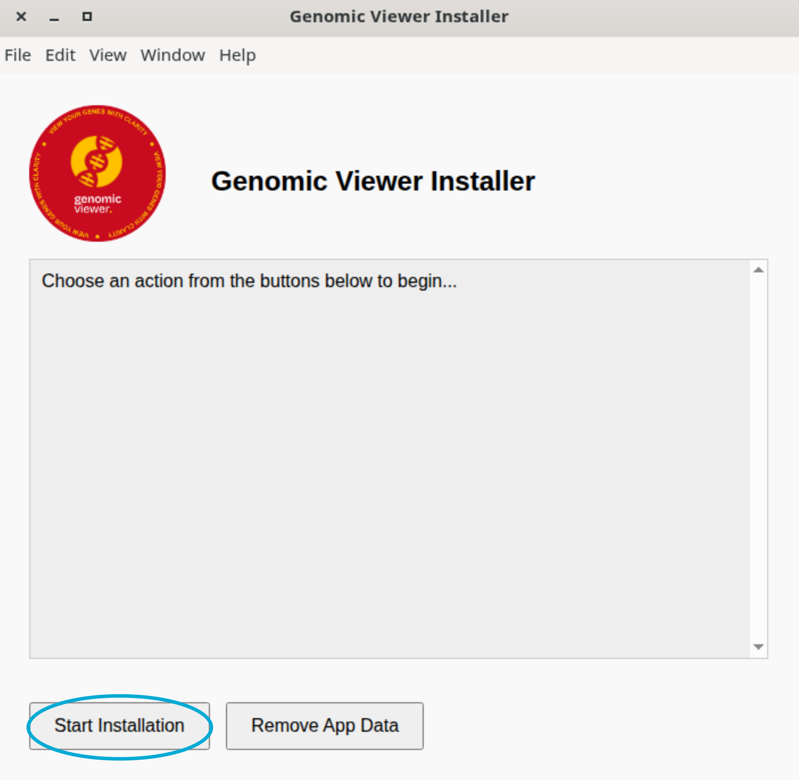

  iii) After a while (it pulls the Docker image first), the installer will open
       a file selection box. This will save the startup script for
       ***Genomic Viewer*** and the chosen directory will also determine the
       location of the accompanying data and the config file. Either choose an
       existing directory or create a new one.

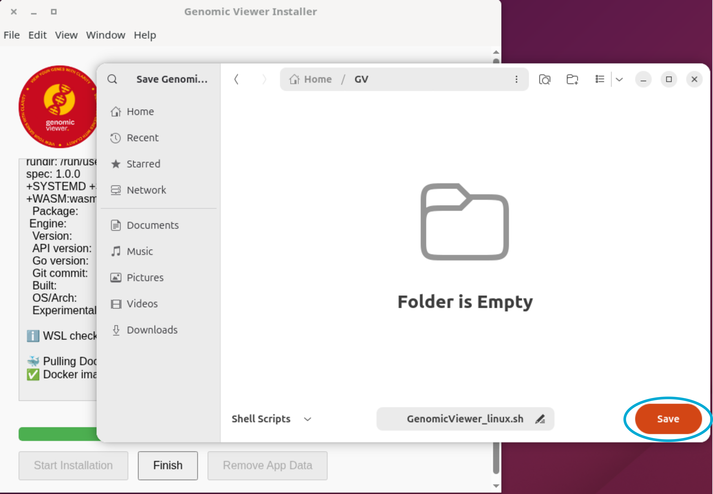

  iv) After completing the installation, click `Finish` to close the installer.

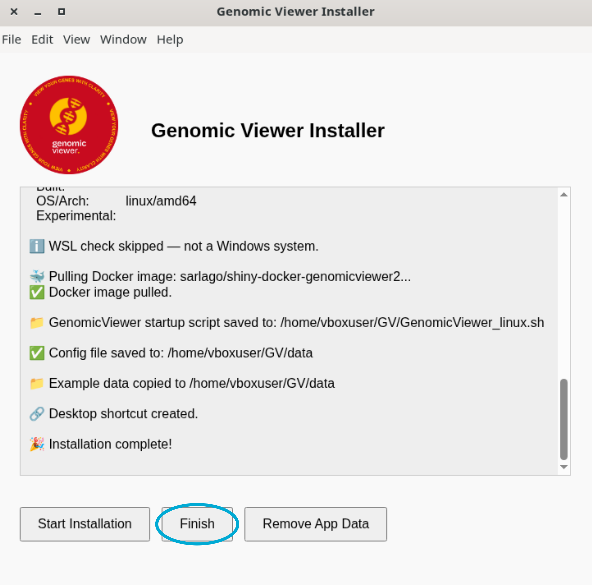

  v) ***Genomic Viewer*** is now ready to be started by double-clicking on the
     desktop icon. Gnome users are aware that Gnome does not offer icons on
     the desktop. The program can be started by running the script
      
    `./GenomicViewer_linux.sh`
     
  in the chosen installation directory.

  vi) Keep the installer file in case you want to remove the software later.
  

------------------------------------------------------------------------

## macOS

&nbsp;

1. Ensure you meet all the [prerequisites](../README.md#installation) for a successful
***Genomic Viewer*** installation. Here is a checklist:

  - Docker is installed. ✅

  - You have downloaded ***Genomic Viewer*** release for macOS
    (see step 2 below). ✅

  For users without root privileges Docker can be installed as follow:

  i) Download [Docker Desktop](https://docs.docker.com/desktop/setup/install/mac-install/).

  ii) Instead of dragging the Docker icon to `Applications`, create your own
      `apps` directory in a desired location. Next drag and drop the Docker icon
      into your `apps` directory.

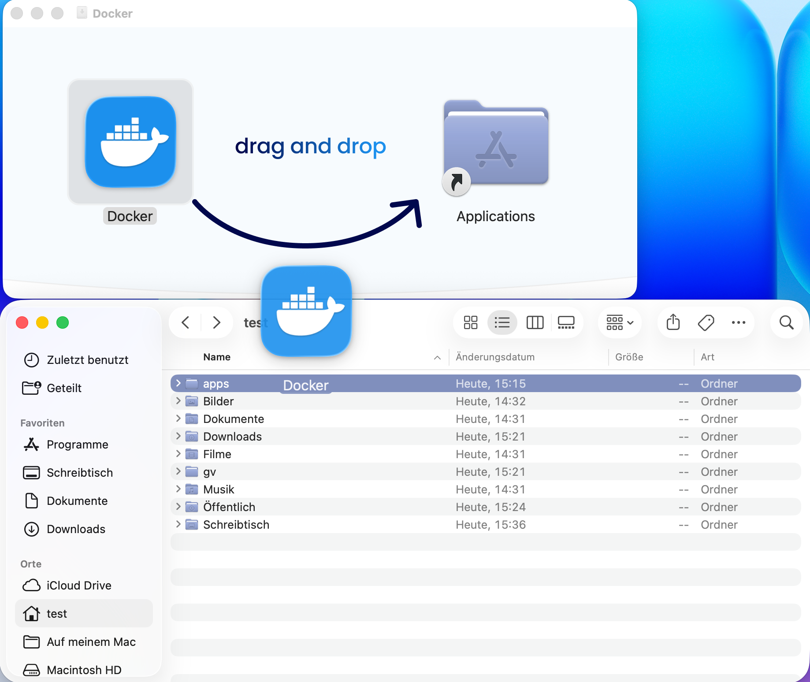

  iii) Start Docker and follow installation instructions. In the configuration
       page select `Use advanced settings` > `User` >
       `Automatically check configuration` > `Finish`.

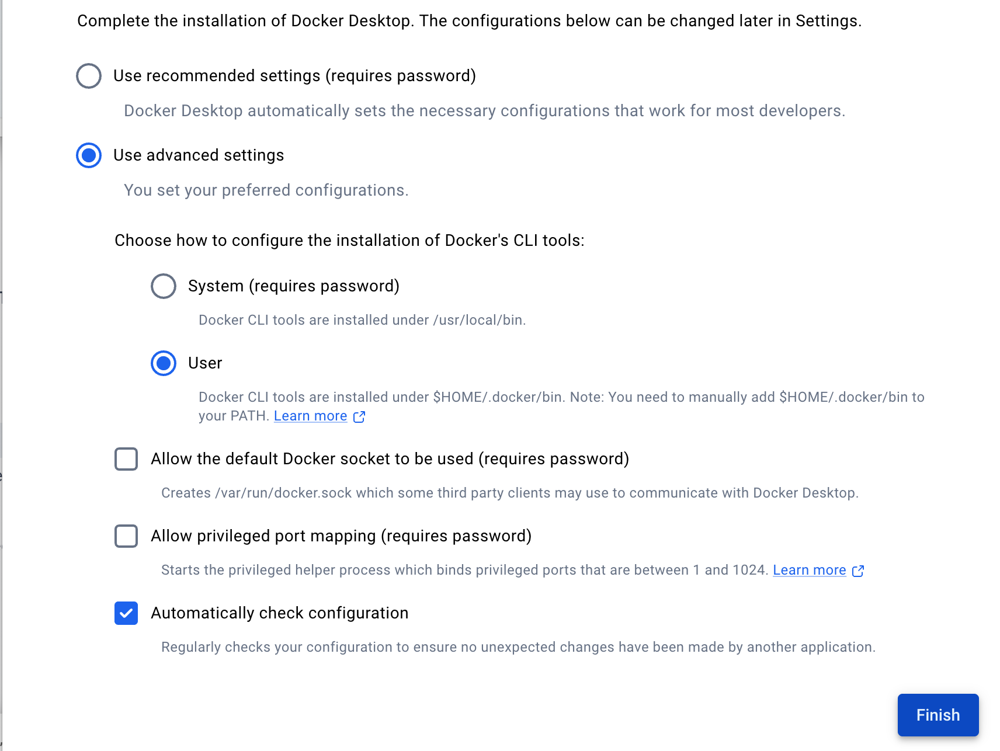

2. Download ***Genomic Viewer*** installer from GitHub:

  i) Go to the [releases](https://github.com/EuracBiomedicalResearch/genomic_viewer/releases)
     page of the ***Genomic Viewer*** GitHub repository.

 # Replace this with correct image once we have the new release!!

  ii) Under `Assets` choose the corresponding installer for macOS and start
      its download.

 # Replace this with correct image once we have the new release!!

3. Launch ***Genomic Viewer*** directly:

  i) Once download has completed, extract the `genomicviewer-run-macos.zip` to
     the desired location.

  ii) Right click on `genomicviewer-run-macos` extracted directory and choose
      `Services > New Terminal at Folder`.

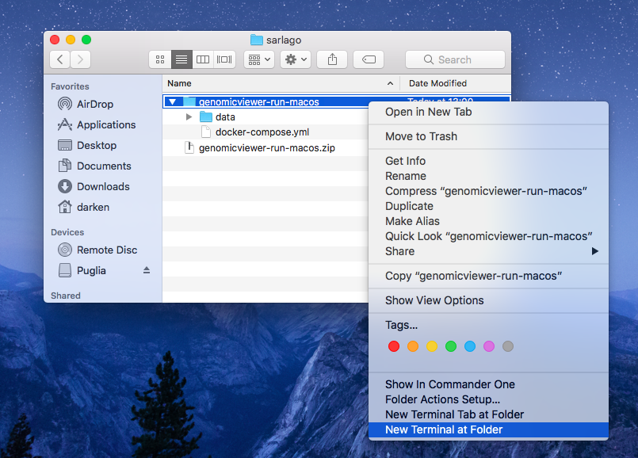

  If you don't see this option, enable it:

  - Open `System Settings → Keyboard → Keyboard Shortcuts`.

  - Go to `Services`.

  - Under `Files and Folders`, enable `New Terminal at Folder` (and/or
    `New Terminal Tab at Folder`).

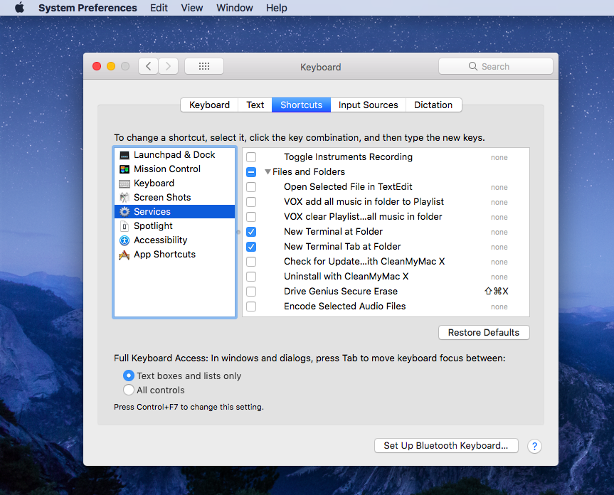

  iii) If you are running ***Genomic Viewer*** without root privileges export
       Docker binaries to `PATH` by typing:

    export PATH="$HOME/.docker/bin:$PATH"

   Otherwise skip this step.

  iv) Type the following command in terminal `docker compose up`.
       This will pull the docker image if not already present, or directly run
       ***Genomic Viewer*** application.

  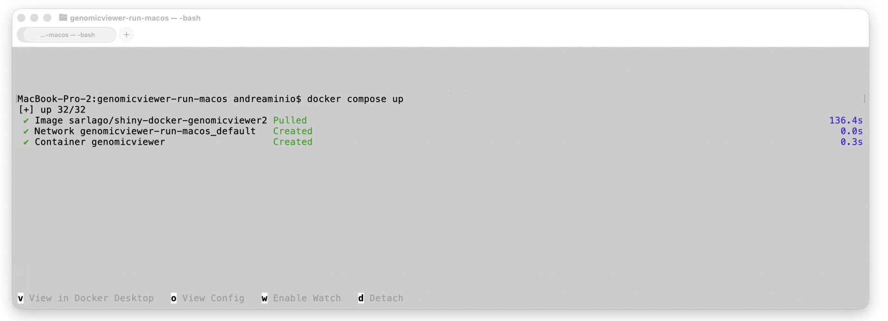

  v) Once loading is finished and the following link appears in Terminal
      `http://0.0.0.0:8180`, copy and paste it in a browser window to use the
      ***Genomic Viewer*** application.
      If it does not work on your platform, you can use `http://127.0.0.1:8180` or
      `http://localhost:8180`

  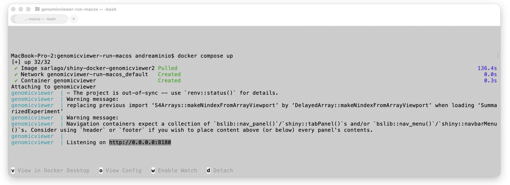

  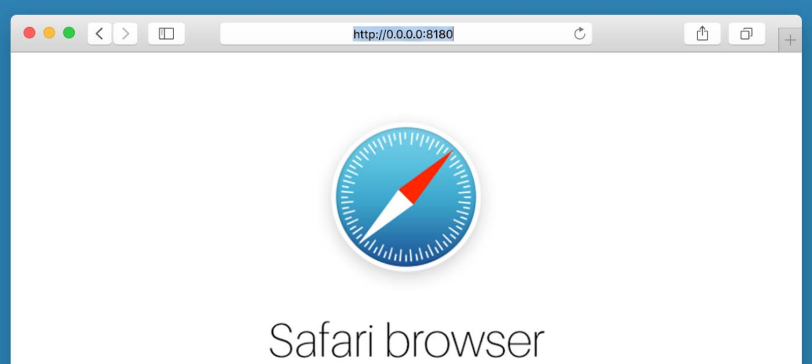

------------------------------------------------------------------------

