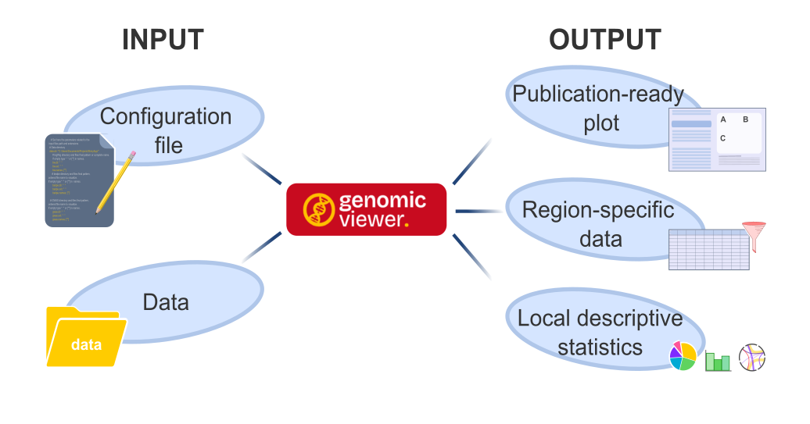

---

# Genomic Viewer Reference Manual

**Version:** 1.0.0\
**Description:** Genomic Viewer is a cross-platform application for visualizing and analyzing genomic data hosted in a Docker container.

------------------------------------------------------------------------

## Table of Contents

&nbsp;

1.  [Configuration](#configuration)
2.  [Features and Usage](#features-and-usage)
3.  [File formats](#file-formats)
4.  [Tutorial](#tutorial)
5.  [Getting Help](#help)
6.  [References and Links](#references-links)

------------------------------------------------------------------------

## Configuration

Document all configurable items:
- Application preferences
- Environment variables
- Integration with external tools

## Features and usage

Explain major features in dedicated subsections.

### Data Import
How to load files, accepted formats, drag-and-drop support.

### Visualization
Plots, settings, export options.

### Analysis Tools
All computational or analytical modules.

### Export Functionality
Which file formats can be exported.

### Central Panels {#central-panels}
- Plot viewer
- Data viewer
- Stats panel

### Sidebars Actions

**Left sidebar**

| Section/Button     | Function                                                                                                                                             |
|--------------------|------------------------------------------------------------------------------------------------------------------------------------------------------|
| Reference genome   | Select a reference genome form list                                                                                                                  |
| Insert coordinates | Choose chromosome to visualize from drop-down menu and enter start and end coordinates                                                               |
| Load coordinates   | Load a bed format file with a list of saved genomic coordinates, if present, the file specified in the configuration file will be loaded as default  |
| Go button          | generate plot according to the selected options                                                                                                      |
| Save button        | Export plot choosing among different formats: .svg, .pdf, .png, .jpg  

## File Formats

## Tutorial

This section contains an easy tutorial exaplaining how to use ***Genomic Viewer*** principal functionality through a practical example with real data.
In this tutorial you will learn how to:
- Correctly set navigation and graphical parameters to visualize genomic tracks.
- Generate a plot with diverse genomic data.
- Navigate throughout the genome.
- Export subset of the raw data.
- Evaluate data based on the stats.
- Formulate biological hypothesis driven by data integration.

## Getting Help

For **general support** questions, **reporting a bug** or **suggest a new feature** you can create an issue in our [Github repository](https://github.com/EuracBiomedicalResearch/genomic_viewer).

For **confidential reports** you can contact us by [email](mailto:sara.lago@eurac.edu).

## References and Links
