# Genomic Viewer Reference Manual
<div align="center">

</div>

**Version:** 1.0.0
**Description:** Genomic Viewer is a cross-platform application for visualizing
and analyzing genomic data hosted in a Docker container.

------------------------------------------------------------------------

## Table of Contents

<details open>
<summary>&nbsp;</summary>

1.  [Configuration](#configuration)
2.  [File Formats](#file-formats)
3.  [Features and Usage](#features-and-usage)
4.  [Tutorial](#tutorial)
5.  [Limitations](#limitations)
6.  [Getting Help](#help)
7.  [References and Links](#references-links)

</details>

------------------------------------------------------------------------

## 1. Configuration

<details open>
<summary>&nbsp;</summary>

***Genomic Viewer*** uses a *configuration file* to load the genomic datasets to
be visualized. This is the only required input for starting a session. 
It defines which data are loaded and how they are visualized.

During [***Genomic Viewer***
installation](https://github.com/EuracBiomedicalResearch/genomic_viewer/blob/docker-genomicviewer/README.md#installation)
a pre-filled example *configuration file*, named `GenomicViewer_config.yml`, is 
saved automatically in a local folder of your choice, together with demo data.

### Example configuration file

The example *configuration file* is reported below. Guidelines for how to fill it 
are present as comments in the file itself (after the `#` mark). In addition, all 
fields and features are explained in detail in the following sections. 

```
---

# Example configuration file for Genomic Viewer, used in the tutorial.

# Notes:
# 1) Starting the file with three dashes is recommended to indicate where the
#    file begins.
# 2) The 'default' key is required for the app to correctly recognize your
#    configuration file.

default:

  # Input files and track label handling.

  # Data parent directory to search for.
  data.dir: "data"

  # Specific file formats section.
  # Note: Specify the following keys information for every file section below:
  # 1) 'dir': directory containing the files specified in that block.
  # 2) 'file': A file name or part of a file name that matches a file/list of
  #           files with the same format.
  # 3) 'names': list of the sample names to be displayed.

  # BIGWIG files section.
  bw.dir: "GSE212908_RAW_ATAC_bigwig"
  bw.file: "treat_pileup_chr5.bw"
  bw.names: ["Kidney cortex 12", "Kidney cortex 15"]
  # BEDPE files section.
  bedpe.dir: "GSE212910_RAW_HiC_bedpe"
  bedpe.file: "GSM6560960_mustache_0.1_0.2_out.diffloops_in_cortex_2_chr5.bedpe"
  bedpe.names: ["HiC arches"]
  # BED or BAM files section.
  bed.dir: "GSE212908_ATAC_peaks"
  bed.file: "GSE212908_RAM012_013_015_peak_masterlist_chr5.bed"
  bed.names: ["ATAC peaks"]
  # HiC files section.
  hic.dir: "GSE212910_RAW_HiC"
  hic.file: "GSM7749626_Cortex_partitioned_donor5_DM_chr5_50000.ginteractions.tsv.short.sorted.hic"
  hic.names: ["HiC cortex"]
  # GWAS files section.
  gwas.dir: "GWAScatalog_KidneyDisease"
  gwas.file: "relocatedCol_chr5.tsv"
  gwas.names: ["GWAS CKD"]
  # Categorical BED files section.
  cat.dir: ""
  cat.file: "regulatory_elements_hg38_chr5.bed"
  cat.names: ["Regulatory Elements"]

  # File with user-defined list of coordinates.
  # Note: Specify the following keys:
  # 1) 'dir': the directory that contains the file;
  # 2) 'file': the file name or shorter matching substring.

  reg.dir: ""
  reg.file: "Example_region_table.bed"

```

### Configuration file format and structure

The ***Genomic Viewer's*** *configruation file* uses YAML syntax, consisting of 
`key: value` pairs. All the keys present in the example file must be preserved,
but their order is not relevant. Comments are supported using `#`.

The file is parsed in R using `config::get()`, which internally relies on a YAML
parser. 

The *configuration file* begins with three dashes `---` indicating the start of 
YAML syntax, and consists of a single `default` section. `dafault` is a required
key for the correct recognition of your *configuration file*.
Within this section, the base directory containing all your data is specified
in the `data.dir` key. Moreover, each supported genomic [file type](#file-formats) 
has its own group of keys.

Each group follows the same pattern:

- `*.dir` — subdirectory, or array of subdirectories relative to `data.dir`;

- `*.file` — file name or extension;

- `*.names` — array of sample names that will be displayed.  

**Notes:** The `*.names` field is present for all file groups except one, which does
not require track labeling. This exception is specified in the relative chunk of
the *configuration file* itself (see example above). 

A single occurrence of each key must always be present for each file group. 
Duplicated keys are not allowed.

### How to correctly specify the keys value

Specifying the keys value in the correct format is fundamental to ensure your 
files are searched properly. The rules to fill each type of key are explained
below:


1) The `data.dir` field accepts a quoted directory name. Directory with
subdirectories common to all files are also accepted 
(e.g. `"data/experiment_1/replicate_1"`).


2) The `*.dir` field relative to file type groups accepts:
  
  - a full directory name (e.g. `"RNAseq"`);
  
  - an array with multiple directory names, when files of the same type are 
    saved in different folders (e.g. `["RNAseq", "ATACseq"]`);
    
  - an empty string `""` for no directory.
    
Paths with subdirectories are also allowed (e.g. `"RNAseq/untreated"`)


3) The `*.file` field accepts:

  - a full file name (e.g. `"RNAseq_sample1_rep1.bed"`);

  - a file extension (e.g. `".bed"`);

  - a regular expression or wildcards, useful to match multiple files 
    (below a note for how to apply them);

  - an empty string `""` for no file.

Regular expressions and wildcards are a tool for text-searching using special 
sequence of characters to define a pattern. This can be useful when you have 
very long or complex file names, or a long list of files to specify. It will 
spare you time and is safer for preventing spelling errors.
Regular expressions that you can use in the *configuration file* uses the 
extended syntax as implemented in R and are explained into details 
[here](https://stat.ethz.ch/R-manual/R-devel/library/base/html/regex.html).
For wildcards refer to [this page](https://cran.r-project.org/web/packages/csquares/vignettes/wildcards.html).

To mention a use case, let's have a look at the `BIGWIG file section` of the 
example *configuration file*:

```
  # BIGWIG files section.
  bw.dir: "GSE212908_RAW_ATAC_bigwig"
  bw.file: "treat_pileup_chr5.bw"
  bw.names: ["Kidney cortex 12", "Kidney cortex 15"]

```
The file pattern `"treat_pileup_chr5.bw"` is searched in the 
`""GSE212908_RAW_ATAC_bigwig""` directory. Upon [***Genomic Viewer*** 
installation](https://github.com/EuracBiomedicalResearch/genomic_viewer/blob/docker-genomicviewer/README.md#installation)
two files matching this pattern will be available from the specified folder:
`"GSM6560954_cortex_12_treat_pileup_chr5.bw"` and 
`"GSM6560956_cortex_15_treat_pileup_chr5.bw"`. There are several alternatives to 
obtain the same result through regular expressions and wildcards, for instance:

  - by using the operator `|`, which allows to
    specify two alternative patterns to be matched (e.g 
    `"GSM6560954_cortex_12_treat_pileup_chr5.bw|GSM6560956_cortex_15_treat_pileup_chr5.bw"`
    or in shorter form `"12_treat_pileup_chr5.bw|15_treat_pileup_chr5.bw"`);
    
  - by using a combination of character classes and metacharacters, 
    e.g. `"^[A-Z0-9]+_cortex_[0-9]{2}_treat_pileup_chr5.bw"`, where `"^[A-Z0-9]+"`
    means the file name must start (`^`) with an alphanumeric string with capital
    letters `[A-Z0-9]` matched one or more times `+`. It follow the strings 
    `_cortex_`, and `_treat_pileup_chr5.bw` separate by two digits `[0-9]{2}`. 
    This example is too elaborated for this use case, but is for illustrative
    purpose only.

When multiple files match, they are:

  - sorted alphabetically;

  - loaded in that order.


4) The `*.names` field accepts:

  - arrays of strings (e.g. `["sample1", "sample2"", ..]`).
  
  - empty arrays for no name `[""]`.
  
Track names are read in the order specified by the user, so they must match the 
alphabetical order of the files.

**Tip:** when you have a long list of files the easiest way to ensure a matching
between files and track names is to add either 1, 2,..9 or A, B,..Z at the 
beginning of the file names to respect the alphabetical order.

### Error handling

After loading, the configuration is explicitly validated by
***Genomic Viewer***:

- YAML syntax errors are detected at load time;

- Required keys are checked for presence;

- Unknown or misspelled keys are rejected;

- Each file type section is validated against the expected format.

If the configuration is invalid, the application fails fast with a clear error
message.


### How files are discovered

If no syntax error is detected in the *configuration file* ***Genomic Viewer*** 
constructs file paths for each file type group as follows:

- The base directory is taken from the `data.dir` key;

- The subdirectory defined in `*.dir` is appended (if provided);

- Files matching `*.file` are searched within that directory.

### Disabling a file type

If no data of a given type should be loaded, all corresponding fields must be
defined but left empty.

Use either:

- an empty string: " "

- or an empty array: [""]

This applies to` *.dir, *.file, and *.names`.

Commenting out sections is not supported.

### Notes on specific file types

For BAM files, it is recommended to use a regular expression ending with $
(e.g. .bam$) to avoid accidentally matching bam.bai index files.

### Multiple sessions

Genomic Viewer always reads a single configuration file named
`GenomicViewer_config.yml`.

To work with multiple sessions:

- save the *configuration file* you want to store in a safe directory, 
  or change the file name;

- be sure that the desired file from which to search the data is into the 
  application directory before startup.


<!-- 

 - The assignment of bw.names to tracks inside the respective files is not at
   all user friendly and very prone to errors. How should the user know what
   is the alphabetical order of all items? I would prefer something more
   explicit.
-->

<!-- General recommendatation:

 I have used a (hopefully) consistent way for formatting text. Yours was full
 emphasis markup that did not improve readability. Please stick to this now.

 - Consistently write ***Genome Viewer*** as virtually the almost only font
   variant.
 - Buttons are only *ButtonName*. Eg. 'Hitting the *Go* button'.
 - Same with all the panels and other graphical elements we refer by name:
   only their name is emphasized with markup. *Stats* panel.
   *Input coordinates:* panel.
 - Genomic file types are written as they should be (BED, BEDPE, BAM, bugWig).
 - A graphics file format is upper case (PNG, SVG, PDF, ...) and a file
   extension used in a file name is lower case (.png, .svg, .pdf).
 - Tried to avoid using 'The user...' sentences in many cases. Indirect speech
   is better. 'You' and 'One' is also ok in some cases.A

-->

</details>

------------------------------------------------------------------------

## 2. File Formats

The following section will describe the file formats that can be imported in
**Genomic viewer**, mentioning if there are specific requirements and for which
track plot they are useful.

<details open>
<summary>bigwig</summary>

### bigWig

Most of the 2D NGS datasets are stored as bigWig file format, which represents
values along the genome, such as read coverage, signal intensity, or enrichment
scores. BigWig files are indexed binary files allowing fast access of selected
portions.

The most common data types that can be loaded through a bigWig file are
ChIP-seq, CUT&Tag, ATAC-seq, RNA-seq and any genome-wide quantitative signal
dataset.

For more details on the bigWig track format see the [UCSC web
portal](https://genome.ucsc.edu/goldenpath/help/bigWig.html).

</details>

<div>
<details open>
<summary>BED</summary>

### BED

[BED files](https://www.ensembl.org/info/website/upload/bed.html) are used to
store genomic ranges annotations, which can be for instance ChIP-seq or
ATAC-seq peaks. BED files can contain a variable number of columns with
mandatory and optional information. For the purposes of ***Genomic Viewer***
only three fields are strictly necessary in this tab-separated file:
**chromosome name**, **start**, **end**. For example:

```
chr1  213941196  213942363
chr1  213942363  213943530
chr1  213943530  213944697
```

Make sure that your file does not have a header with column names (like `chr`,
`start`, `end`, or a comment `#`) to ensure proper reading of the file. 
Always specify "chr" before the chromosome number for all the [built-in reference 
genomes](#reference-genome) (i.e. "chr1", not "1" and not trailing zeroes 
"chr01").
Additional columns are allowed, those will be displayed in the [*Data*
navigation tab](#data-subsetting), but are ignored for plotting.

</details>
</div>

<div>
<details open>
<summary>Categorical BED</summary>

### Categorical BED

In addition to the standard BED file, ***Genomic Viewer*** also accepts
categorical BED files which are structured like the standard BED but have an
additional required column, assigning the corresponding genomic range to a
user-defined category. In addition, categorical BED columns are named with a
header, as in the example below.  Categorical BED can be used for example to
classify peaks or functional genomic elements. For instance, several
functional element coordinates (like the ones provided for in the
[tutorial](#tutorial)) can be downloaded from [UCSC Table
Browser](https://genome.ucsc.edu/cgi-bin/hgTables). The resulting file looks 
like this:

```
chr	start	end	category
chr1	155188536	155192004	h38_CpGIslands
chr1	2226773	2229734	h38_CpGIslands
chr1	36306229	36307408	h38_CpGIslands
chr1	47708822	47710847	h38_CpGIslands
chr1	53737729	53739637	h38_CpGIslands
chr1	101302963	101302972	h38_TSSpeaks
chr1	101304214	101304218	h38_TSSpeaks
```

Note that the same genomic range can belong to two different categories, in
this case the entry must be repeated two times, with a single value in the
category field. Additional columns will be ignored for plotting but are kept
in the [*Data* navigation tab](#data-subsetting).

*Categorical BED* format is highly flexible, allowing many different types of
data to be organized and visualized.

</details>
</div>

<div>
<details open>
<summary>HiC</summary>

### HiC

3D contacts files, like HiC, stored in [HiC file
format](https://genome.ucsc.edu/goldenpath/help/hic.html).  This is a binary
format allowing fast access to contact matrices and is used for displaying
chromatin conformation data in our browser. HiC files are generally large files
and can store the information at different resolutions and normalizations. It
is suggested to include a column with *KR normalization*. More on HiC
*normalization methods* can be found in the [*Normalization of Hi-C
Maps*](https://gcmapexplorer.readthedocs.io/en/latest/cmapNormalization.html)
article. Based on their availability in the source data file, ***Genomic
Viewer*** reads `.hic` files at different resolutions depending on the size
of the requested genomic window to plot.

</details>


<div>
<details open>
<summary>BEDPE</summary>

### BEDPE

3D contacts can also be stored as arches connecting two distal genomic regions.
This type of information is stored in the [BEDPE file
format](https://bedtools.readthedocs.io/en/latest/content/general-usage.html#bedpe-format).
Normally BEDPE files are 6 columns files with *chr*, *start*, *end* fields of
the two anchor and bait regions, however optional columns can be added. In the
latter case column 7 contains an ID, the 8th column is a number representing
the score and the 9th column represents the DNA strand. A column header is
optional and will not affect the output.

An example of the minimal BEDPE file structure is reported below:

```
chrA  startA  endA  chrB  startB  endB
chr5	74050000	74060000	chr5	74640000	74650000
chr5	75350000	75360000	chr5	75670000	75680000
chr5	75740000	75750000	chr5	76150000	76160000
chr5	77560000	77570000	chr5	77960000	77970000
```

</details>
</div>


<div>
<details open>
<summary>GWAS</summary>

### GWAS

Genome Wide Association Studies (GWAS) datasets are stored in a dedicated file
format. The [GWAS Catalog](https://www.ebi.ac.uk/gwas/) database
storing this type of data has recently updated and uniformed the structure of
the deposited summary statistics file format.  These are normally stored as
gzipped .tsv files since contain huge amount of data.  To generate a
Manhattan plot with ***Genomic Viewer*** there are four required fields,
which contain information about **chromosome name**, **position**, **p-value**
and **SNP id**.  These fields must be tab-separated and named with a header as
in the example below:

```
chrom   pos         p       snp
chr1	162766673	3.1e-01	rs1000050
chr1	157285606	1.1e-02	rs1000073
chr1	94701276	4.5e-01	rs1000075
chr1	66392232	3.3e-01	rs1000085
chr1	62967045	5.3e-01	rs1000127
chr1	205536349	6.0e-01	rs1000312
```

Any number of additional fields can be optionally added with no restriction in
their name. All of the minimal required fields are always available in [GWAS
Catalog](https://www.ebi.ac.uk/gwas/) summary statistics files. It is however
recommended to check the columns headers to match the ***Genomic Viewer***
requirements. If only plots will be generated, in order to save space and
increase loading speed, we recommend to keep only the four required columns.

</details>


<div>
<details open>
<summary>bam</summary>

### BAM

The BAM file format is a binary file format used to store the results of
sequencing reads alignments. To allow graphical tools to access this type of
data the file must be indexed, therefor every `.bam` file must always be
associated to a corresponding `.bam.bai` file. For a more extensive description
of BAM files we refer to the [BAM Track
Format](https://genome.ucsc.edu/goldenpath/help/bam.html) of the UCSC web
portal.  Sometimes publicly deposited BAM files are not indexed, in order to
index a bam file it is recommended to use [*Samtools
index*](https://www.htslib.org/doc/samtools-index.html) function.  BAM files
tend to be large files.

</details>
</div>
</div>
</div>

------------------------------------------------------------------------

## 3. Features and Usage

In the following section the user will find a detailed description of the main
functions that are available from ***Genomic Viewer*** interface.

<div>
<details open>
<summary>Interface organization</summary>

### Interface organization

The user interface of ***Genomic Viewer*** is split into three main areas: left
and right sidebar and the central window.


**Left sidebar**

| Section/Button     | Function                                              |
|--------------------|-------------------------------------------------------|
| Reference genome   | Select a reference genome form list.                  |
| Insert coordinates | Choose chromosome to visualize from dropdown menu and 
|                    | enter start and end coordinates.                      |
| Load coordinates   | Load a BED format file with a list of saved genomic   
|                    | coordinates. If present, the file specified in the    
|                    | configuration file will be loaded as default.         |
| Go button          | Generate plot according to the selected options.      |
| Save button        | Export plot choosing among different formats:         
|                    | SVG, PDF, PNG, JPG.                                   |


**Right sidebar**

| Section/Button     | Function                                              |
|--------------------|-------------------------------------------------------|
| Choose chromosome  | Select a chromosome to plot by hovering over the plot |
|                    | and clicking.                                         |
| Search by gene     | Search the genomic coordinates of a gene              |
| bigWig plot mode   | Choose if plotting bigWig tracks in profile or heatmap|
|                    | mode. Both plots can also be generated simultaneously.|
| Autoscale settings | Define grouping rule for autoscaling bigWig tracks.   |
| Expand category    | Expand tracks loaded from categorical BED files to    |
|                    | avoid categories overlap.                             |
| Expand transcripts | Alternative to gene label track, plots transcript     |
|                    | isoforms individually.                                |
| Chromosome ideogram| If checked, shows the chromosome ideogram in the plot.|

**Central window**

| Section/Button     | Function                                              |
|--------------------|-------------------------------------------------------|
| Plot, Data, Stats  | Click to access the corresponding navigation tab and  |
|                    | related functions.                                    |
| Zoom section       | Increase/decrease genomic range in the plot.          |

</details>
</div>

<div>
<details open>
<summary>Reference genome</summary>

### Reference Genome

Choosing a reference genome is the first essential step to address before
generating any plot. The reference genome provides the desired coordinates to
ensure that the values you enter in the GUI match the data. The reference
genome can be selected from a built-in list available form a dropdown menu at
the top of the left sidebar. The reference genome and all user-supplied data
files (via the the [configuration file](#configuration)) have to match. At
***Genomic Viewer*** startup the human hg19 (GRCh37) version of the reference
genome is loaded by default.

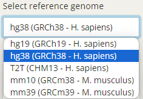

Changing the selected working reference genome will affect the list of
chromosomes in the *Insert coordinates* panel, the chromosome hover plot, the
list of available gene names and the gene annotation labels in the main plot
output.

</details>
</div>

<div>
<details open>
<summary>Navigation</summary>

### Navigation

***Genomic Viewer*** offers several options to navigate across the genome.
Their usage is described in the following section.

#### Insert coordinates

One possibility to tell ***Genomic Viewer*** which coordinates you want to plot
is through the *Insert coordinates* panel.  This panel allows to manually
insert coordinates to be plotted by selecting the chromosome name from a
dropdown menu, and entering the start and end coordinates in the numeric entry
fields available from the same panel followed by hitting the *Go* button.

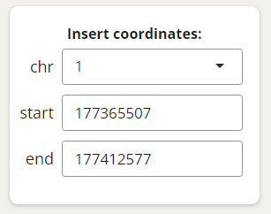

#### Load coordinates

The user can navigate across a list of previously saved coordinates by
specifying a region table BED file to be uploaded through the [configuration
file](#configuration) or by accessing local files in a running ***Genomic
Viewer*** session. The provided coordinates list file must be structured as a
BED file with a minimum of three tab separated columns corresponding to:
chromosome, start, and end. It is recommended to have a fourth column with a an
ID for the corresponding genomic region. Column headers should be avoided.

An example of region table BED file is reported below:

```
chr5	177365507	177412577	SLC34A1
chr5	177372928	177499184	SLC34A1_zoomOut
```

Once the region file is uploaded, the coordinates become available in the
**Select from menu** dropdown list.

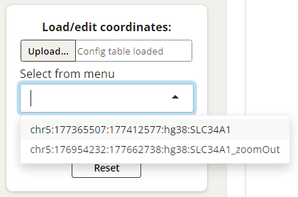

A custom region table list can be created by either generating a new one or by
modifying a previously uploaded table. The *Add* and *Remove* buttons below the
selection dropdown menu allow to access these options. In particular, to add a
new entry to the an existing list or to create a new one after clicking the
*Add* button a pop-up window will appear reporting the selected coordinates and
allowing the user to assign a name to the region. By clicking *Ok* the entry
will be added to the list.

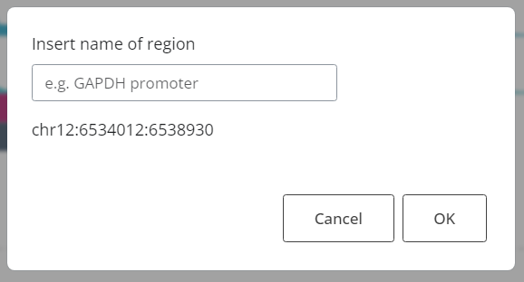

Similarly, if you want to remove a coordinate from the uploaded list, you can
select the entry form the dropdown list and next click the *Remove* button.
The new custom coordinates list can also be exported for later re-use.

To restore the initial setting of the *Load coordinates* panel it is sufficient
to click the *Reset* button at the panel's bottom.

#### Choose chromosome

To visualize a whole chromosome or perform an analysis on it, at the top of the
right sidebar there is a schematized graphics of the chromosomes structures
corresponding to the selected reference genome. The plot will update every time
the user selects a different reference genome.  The *Choose chromosome* plot is
an interactive plot supporting mouse hovering. A label with the chromosome id
of the hovered region will appear below the graph. Upon clicking the
corresponding coordinates are passed to ***Genomic Viewer*** and the genomic
plot or desired analysis can be generated by pressing the *Go* button.

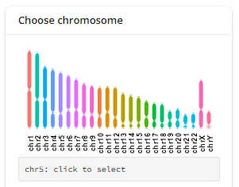

#### Search by gene

If a user is interested in visualizing or analyzing the genomic region
corresponding to a specific gene, the easiest way is to retrieve its
coordinates from the *Search by gene* menu. To search for a gene of interest in
the currently selected reference genome, you can start typing the gene name in
the menu and a list with the matching entries will be displayed below. Once
the gene of interest appears you can click on it and the tool will
automatically load its coordinates. Note that changing the reference genome
after selecting a gene the coordinates will not update automatically, but
you have to search again for the gene in the menu.
<!-- Ideally, change of the reference genome should clear the Load coordinates
 panel. To be implemented! -->

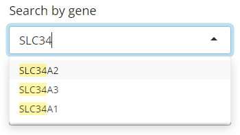

To trigger the generation of the plot or run an analysis, after choosing the
gene of interest one must click the *Go* button.

#### Zoom

The zoom panel located at the bottom of the plot navigation panel in the
central window offers an alternative way for genome navigation. This is
especially useful when investigate the flanking regions of a selected genomic
position or when narrowing down the region of interest. See also the
[Tutorial](#tutorial).

There are two ways for using the zoom panel for navigation:

- **Drag and drop bar**: above the zoom buttons there is a draggable bar
  consisting of an orange rectangle that matches the plotted genomic range and
  a grey flanking region. The scale below the bar represents base pairs.
  Selecting a rectangle within the orange area results in a zoom in, while
  selecting in the grey area a zoom out will be done. The maximum allowed
  zoom-in is 500 bp. The coordinates of the zoomed region will be automatically
  updated in the Insert coordinates panel, but the plot has to be redone
  manually by hitting the *Go* button. This way, multiple zooms can be
  combined.

- **Proportional zoom buttons**: Below the position bar there are buttons to
  zoom in and out 2, 5, or 10 times, respectively. The initially shown area
  will remain the center of zoomed region. Again, hitting the *Go* button will
  replot the newly selected genomic region.


</details>
</div>


### Genomic View Plot

The main graphical output of the app is the genomic view plot, accessed through
the *Plot* navigation tab which is shown by default at startup. The plot is
generated using the track files specified by the user in the [configuration
file](#configuration). ***Genomic Viewer*** handles the genomic data track's
formats using specific functions and graphical parameters which are managed
through custom functions utilizing the
[`plotgardener`](https://phanstiellab.github.io/plotgardener/index.html)[[1]](#ref1)
R package.

<div>
<details open>
<summary>Track specific features</summary>

#### Track-specific Features

Tracks are visualized in the central window in a fix order. In the following
sections, we describe each of them in that order.

##### HiC 3D contact matrix

Files formatted as [HiC](#HiC) are used to plot HiC and 3D contact matrices.
***Genomic Viewer*** represents this type of data as triangular matrices.
Contact scores that are stored in the input file are displayed as a heatmap and
will be scaled in the range of 1-100 to maximize their visual evaluation. The
corresponding scale bar is always reported beside the plot.
<!-- Do not understand what the "range of 1-100" means. Resolution? Specify. -->

These files can be quite large and for performance reasons, ***Genomic
Viewer*** automatically sets different data resolutions based on the size of
the genomic regions that is requested to plot.

In particular:

- for genomic ranges larger than 5 Mbp the binning resolution is 500 Kbp;

- for genomic ranges > 100 kbp and ≤ 5 Mbp the binning resolution is 100 Kbp;

- for genomic ranges > 25 kbp and ≤ 100 kbp the binning resolution is 25 Kbp;

- for genomic ranges ≥ 15 kbp and ≤ 25 kbp the binning resolution is 15 Kbp
  (this must be compatible with the input data resolution, otherwise will not
  be plotted);

- for genomic ranges < 15 kbp the 3D contact matrix will not be plotted since
  it approaches the minimal resolution allowed by the data and will not have a
  significant biological meaning.

The image below shows some examples of HiC heatmaps plotted at different
resolutions according to the genomic range.

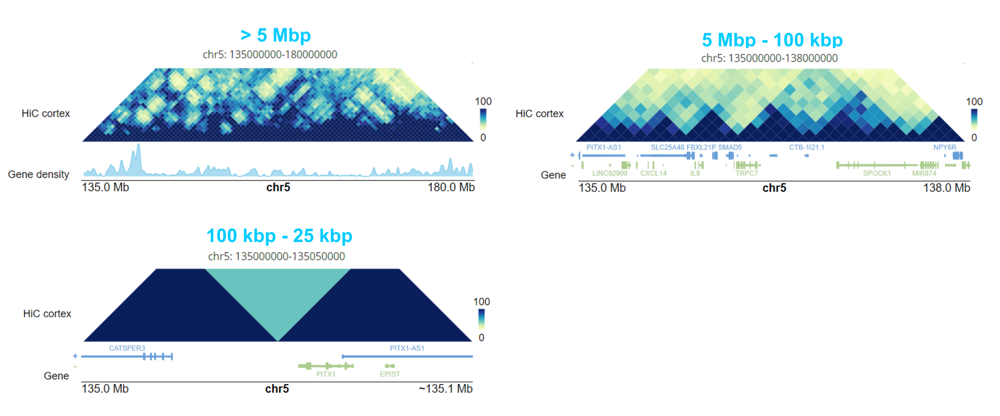

##### BigWig profile and heatmap

Files formatted as [bigWig](#bigwig) are used to plot any coverage or signal
score data like ChIP-seq, ATAC-seq, RNA-seq and many others. The most common
way in which bigWig files are plotted is as signal intensity profile plots,
however in some cases it can be useful to plot them as heatmaps.  **Genomic
viewer** allows both visualization modes, plus it allows to plot the same track
simultaneously as profile or heatmap.

This score information stored in bigWig files is binned. This information is
used to generate either the standard histogram-like profile plots, making use
of the `plotgardener` function
[`plotSignal()`](https://phanstiellab.github.io/plotgardener/reference/plotSignal.html),
or is color-coded in a heatmap through the `plotgardener` function
[`plotRanges()`](https://phanstiellab.github.io/plotgardener/reference/plotRanges.html).

The appropriate plot is chosen in the *Select bigwig plot mode* menu in the
right sidebar. The plot is recreated automatically afterwards.
<!-- why then not also replot when selecting a gene from Search by gene? This
 I have already suggested. -->

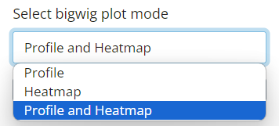

Like the 3D contact matrix plots, also the bigWig files can be plotted using a
different bin size as a compromise between resolution and computational
expenses.

To optimize visualization performance without loosing information, both profile
plots and heatmaps are independently binned based on the size of the genomic
range selected by the user:

- for genomic ranges ≥ 200 Mbp the binning resolution is of 1 Mbp;

- for genomic ranges ≥ 50 Mbp and < 200 Mbp the binning resolution is of 500
  kbp;

- for genomic ranges ≥ 5 Mbp and < 50 Mbp the binning resolution is of 50 kbp;

- for genomic ranges ≥ 100 kbp and < 5 Mbp the binning resolution is of 5 kbp;

- for  genomic ranges < 100 kbp no binning is applied, preserving the
  resolution of the original input file.

The image below shows some examples of profile plots and heatmaps from the
same input bigWig file, plotted at different resolutions according to the
genomic range.

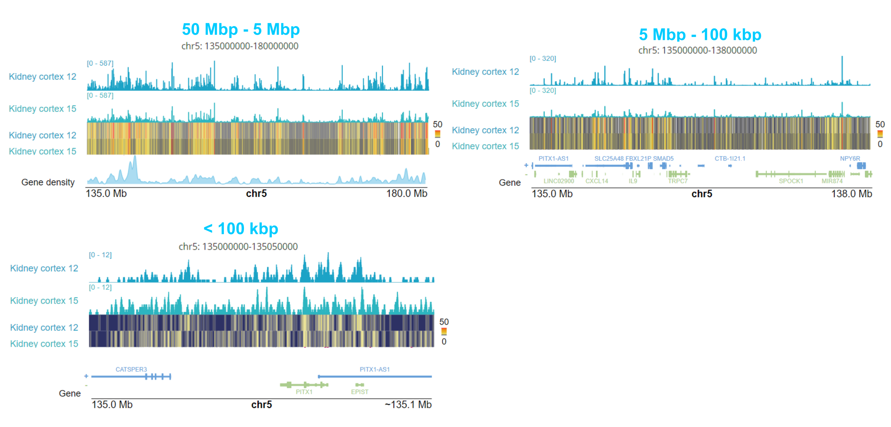

When multiple bigWig files are loaded and want to be compared, it is good
practice to keep the y-axis scale constant for all samples. However, different
sequencing techniques describe different types of data using the bigWig format.
For these reasons ***Genomic Viewer*** offers the possibility to choose y-axis
autoscaling by groups. By clicking the *Autoscale settings* button in the right
sidebar, a pop-up window will appear:

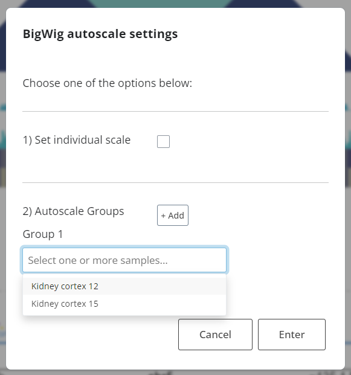

Groups are created by clicking the *+ Add* button and selecting the
corresponding samples.  If no grouping is required, one can check the *Set
Individual Scale* box.

By default the y-scale for bigWig files is automatically auto-scaled based on
the maximal y value over all samples and is updated every time the selected
genomic range is changes. When multiple bigWig files are loaded a different
color is automatically applied to every track. When plotted in the profile
mode the color/score scalebar is displayed on the right of the plot.


##### BED files

The [BED](#BED) file format is commonly used to store information regarding
annotation of peaks or genomic regions of interest in datasets from ChIP-seq
and ATAC-seq experiments. BED files are plotted by ***Genomic Viewer*** using
the `plotgardener` function
[`plotRanges()`](https://phanstiellab.github.io/plotgardener/reference/plotRanges.html).

When multiple BED files are loaded by the user a different color is
automatically applied to every sample.  There is no customization option for
this type of track and binning is normally not necessary. However, when the
plotted range is larger than 10 Mbp, peaks are displayed as density plots to
improve readability and reduce image size.

An example of a peak file track in ***Genomic Viewer*** is shown below:

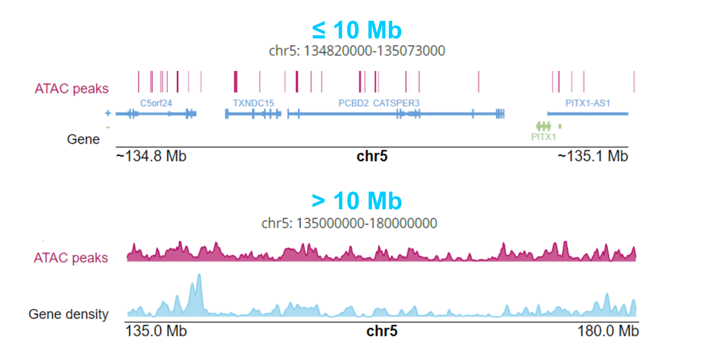

##### BAM files

[BAM](#bam) files store information on individual sequencing reads obtained
after alignment against a reference genome.  In ***Genomic Viewer*** BAM data
are plotted using the same function as for BED files, such that the genomic
range covered by the reads is shown. The two formats are automatically detected
by ***Genomic Viewer*** and while BED files are plotted in collapsed way, the
BAM files are expanded to allow the visualization of individual reads. High
number of reads exceeding plotting space are marked with a `+` sign in the
upper-right part of the track plot.

An example of aligned reads is shown below:

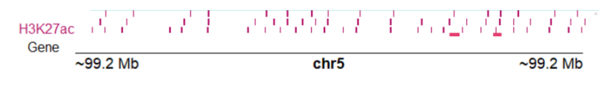

BAM files inspection is not among the main purposes of ***Genomic Viewer***.
Since BAM files are often very large, data are plotted as default behavior only
for highly zoomed region as is also the default behavior of the majority of
genome browsers. For these reasons BAM files are not provided as example
data in the [**Tutorial**](#tutorial), either. Nevertheless, testing this
funcitonality can be done by retrieving the raw data used to generate the
above image from the link reported in the [**References and
links**](#references-and-links) section.


##### Categorical BED files

[Categorical BED](#categorical-bed) files can be used to mark genomic regions
that belong to specific categories, which can be annotated with external tools
or databases, such as user-defined data.  ***Genomic Viewer*** plots
categorical BED files through the `plotgardener` function
[`plotRanges()`](https://phanstiellab.github.io/plotgardener/reference/plotRanges.html).
To every category that is found in the input file a different color is assigned
and listed in a legend displayed to the right of the corresponding track in the
plot. By default all the categories in the same track are *collapsed* in one line,
however, sometimes the genomic ranges belonging to different categories may
overlap, or the same genomic range belongs to two categories. To address these
situations ***Genomic Viewer*** provides the possibility to *expand* the
categories through the *Expand categories* menu in the right sidebar. When
clicking in the menu all the tracks that are uploaded as categorical BED
files are displayed by their label name. The user can choose multiple
of them to be expanded, so that overlapping categories of the same track are
split on different lines.
<!-- The last sentences on displaying and splitting I don't understand at
all. Rewrite. -->

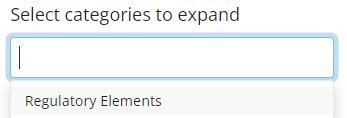

An example of *collapsed* and *expanded* categorical BED tracks is shown in the
figure below:

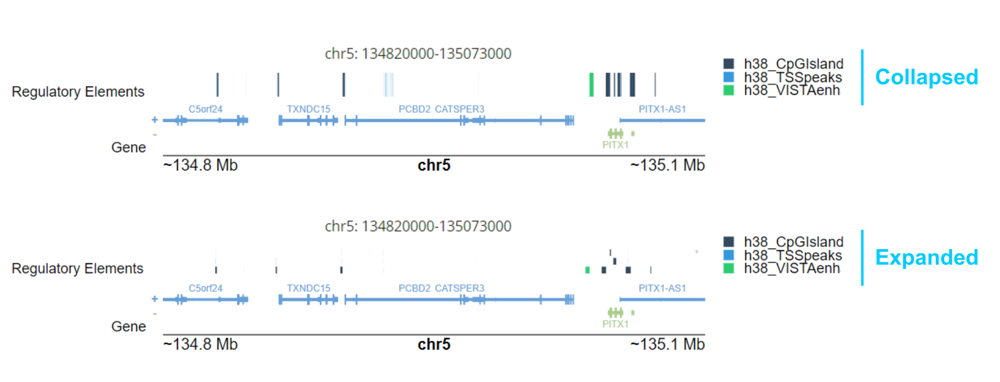

A `+` character displayed at the top-right of the track indicates that some
information is hidden due to space constraints.

##### 3D Contact Arches

In addition to contact matrices and heatmaps, 3D contacts can also be
represented as *arches* connecting the 2D genomic positions.  This type of
representation is stored in [BEDPE](#BEDPE) files and is plotted in ***Genomic
viewer*** through the dedicated `plotgardener` function
[`plotPairsArches()`](https://phanstiellab.github.io/plotgardener/reference/plotPairsArches.html).

There is no customization option for this type of track and binning is not
necessary.

An example of a 3D contact arches track is shown below:

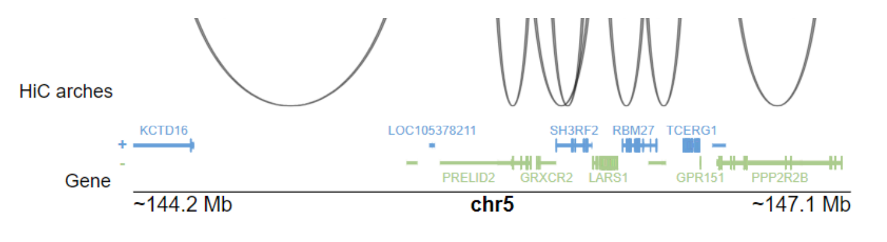

##### GWAS Manhattan

[GWAS summary statistics](#gwas) files are the basis for Manhattan plots.  They
are generated in ***Genomic Viewer*** through the dedicated `plotgardener`
function
[`plotManhattan()`](https://phanstiellab.github.io/plotgardener/reference/plotManhattan.html).
In this plot every SNP is represented by a dot colored by p-value.  The input
file, column `p` (representing the p-value) is automatically converted to
-log10(p-value) as reported on the y-axis scale. A dashed line indicates the
significance threshold and is by default set to 10<sup>-8</sup>.

This track cannot be customized.

An example of a Manhattan plot by ***Genomic Viewer*** is shown below:

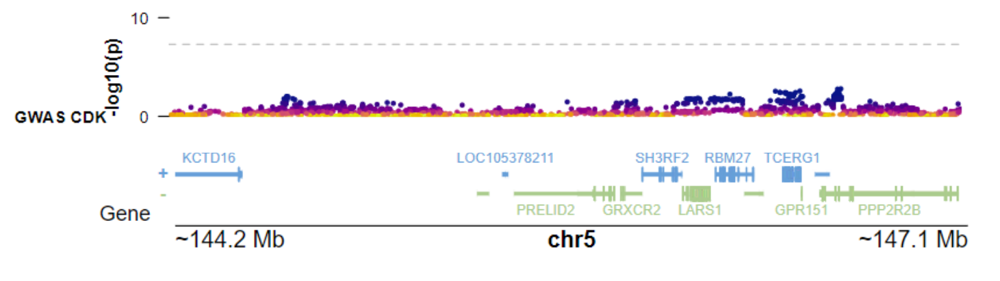

</details>
</div>

<div>
<details open>
<summary>Additional Plot options and features</summary>

#### Additional Plot options and features

##### Image Static Zoom

The `+`, `-` and `RESET` buttons in the lower right corner of the genomic view
plot allow to zoom in and out of the plot without changing the visualized
genomic coordinates.  The graphical resolution of the plot will not change by
zooming in since it is a vectorial image. The `RESET` button allows to
restore the initial plot size. The zoomed image can be panned by click-dragging.
This type of zoom is not taken into account when exporting an image.

In addition the static zoom controller is disabled when the cumulative size of
the files to plot is greater than 2 GB and the selected range to plot larger
than 500 kbp. This is because under such a condition the visualized image is
not vectorial, but is a bitmap for performance reasons.

In any case it will always be possible to download the image in vectorial
resolution (SVG format) using the *Save* button.

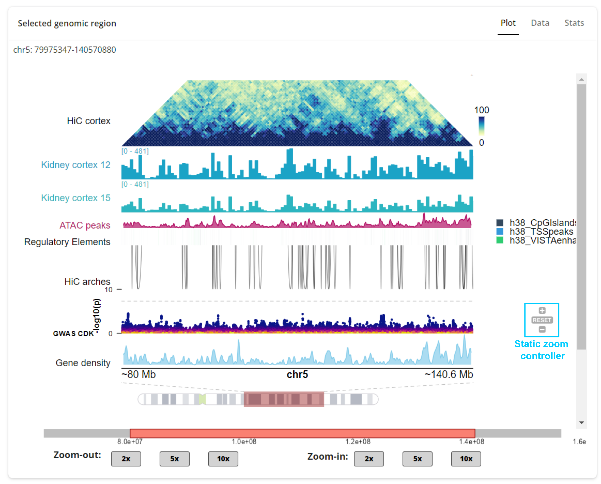


#### Tracks arrangement

***Genomic Viewer*** is designed to minimize the effort required to generate 
publication-quality figures. To achieve this, the overall plot size is fixed, 
and individual tracks are automatically scaled based on their format and number. 
Users can still adjust essential graphical parameters, but do not need to 
manually manage layout or spacing.

</details>
</div>

<div>
<details open>
<summary>Genome annotation</summary>

### Genome annotation

The lowermost part of the main plot output consists of different layers of gene
annotations. Gene annotation is available for all the reference genomes
supported by ***Genome Viewer***.

The representation of genes and genes structures is done with the
`plotgardener` function
[`plotGenes()`](https://phanstiellab.github.io/plotgardener/reference/plotGenes.html).
It allows representation of functional elements like promoters, introns and
exons.

By default genes that are encoded on the leading and lagging DNA strand are
divided into two lines, marked as `+` and `-`.  Genes encoded on leading strand
are shown in green while lagging strand genes are plotted in light blue.

On the right sidebar it is possible to expand transcripts. So instead of genes,
the separated transcript isoforms are displayed on multiple lines.

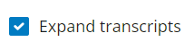

The difference is shown here:

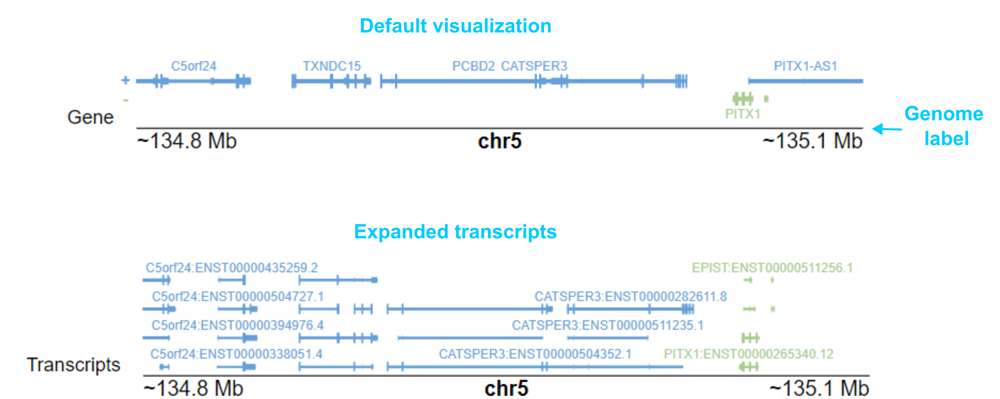

When the genomic range selected for visualization is too wide (> 10 Mbp),
individual genes are not plotted but are substituted by a density plot as shown
below:

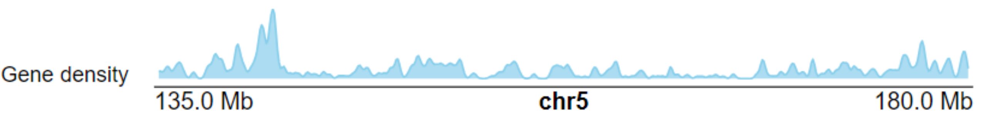

*Note:* The gene density visualization mode disables *Expand transcript*.

A genome label track is always shown below the genome annotation track and is
generated with the `pltgardener` function
[`annoGenomeLabel()`](https://phanstiellab.github.io/plotgardener/reference/annoGenomeLabel.html).


By default, a [Chromosome
ideogram](https://phanstiellab.github.io/plotgardener/reference/plotIdeogram.html)
is shown at the bottom of the plot area. The plotting range on the chromosome
is highlighted in red. An example is shown below:

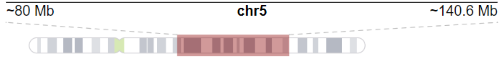

The chromosome ideogram can be switched off by unchecking the *Chromosome
Ideogram* checkbox,


</details>
</div>

<div>
<details open>
<summary>Analysis Tools</summary>

### Analysis Tools

***Genomic Viewer*** provides supporting functionalities designed to assist
researchers in analyzing data. They include data filtering and sorting options,
data-integration charts and basic analytical summaries.  Users can access these
features via the *Data* and *Stats* navigation tabs located in the main central
window of the application.

#### Data subsetting

Through the Data navigation tab, the user can generate subsetted versions of
supported raw data formats, including BED, BEDPE, categorical BED, and GWAS.
Sections names will be updated specifically with the user-defined dataset
labels. The application displays a preview of the subset output limited to the
first 15 rows. The complete subsetted dataset can be retrieved using the
dedicated *Download* button.

Visualization of the subset output in the main window is triggered by clicking
the *Go* button. Exporting the subsetted data enables detailed inspection of
genomic features within regions of interest and enables downstream analysis or
visualization using external tools.

#### Stats analytical summaries

The *Stats* navigation tab provides a set of charts that can be generated by
the user to support data exploration and integration. Each chart can be
produced by pressing the *Run* button in the corresponding section. Sample
names will be updated specifically with the user-defined dataset labels. The
availability of specific charts depends on the input data file format, as well
as on the size of the input file and the width of the selected genomic range.
These constraints are enforced to prevent excessive computational load and the
generation of overly large output. In case a plot is not generated due to file
size/genomic range restrictions, a warning message will appear.

It follows a brief description of the available charts:

1. ***Peaks and arches count***: A barplot for peaks (BED files) and arches
   (BEDPE files) counts in the whole reference genome and in the user-selected
   genomic region. This is useful for looking at the relative abundance of
   peaks/arches features in the selected region compared to the entire genome.

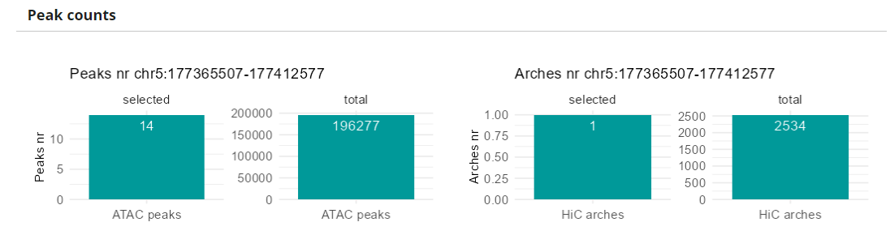

2. ***Peaks and arches overlap***: An upset plot showing the intersection
   between peaks or arches (BED or BEDPE files) of different samples among
   themselves. The overlap of peaks with arches is also reported.  The absolute
   number of overlapping features and their percentage are reported in the
   plots for the entire genome and for the user selected range.

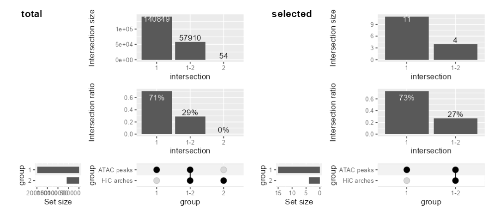

3. ***Peaks Annotation***: A piechart showing peak annotations (calculated from
   BED files) across genomic functional regions, produced with the
   [ChIPpeakAnno](https://bioconductor.org/packages/release/bioc/vignettes/ChIPpeakAnno/inst/doc/ChIPpeakAnno.html)
   R package.  This plot is only generated for peaks in the whole genome,
   without subsetting the user-selected genomic range.

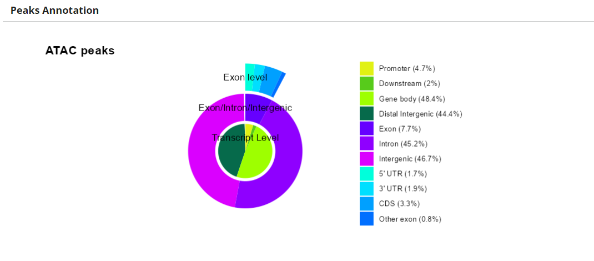

4. ***Circos plot for 3D contacts***: A circos plot representing a circular
   visualization of the chromosome containing the user-selected genomic range.
   Several concentric circles inside the chromosome (from outer to inner) will
   represent the 3D contact density in the whole chromosome, the contact arches
   in the chromosome, in the outer section.  The inner circles show the zoom in
   of the user-selected range with 3D arches and gene names annotations. This
   is a more compacted view to evaluate contacts in their genomic context. A
   different color is automatically assigned to each chromosome.

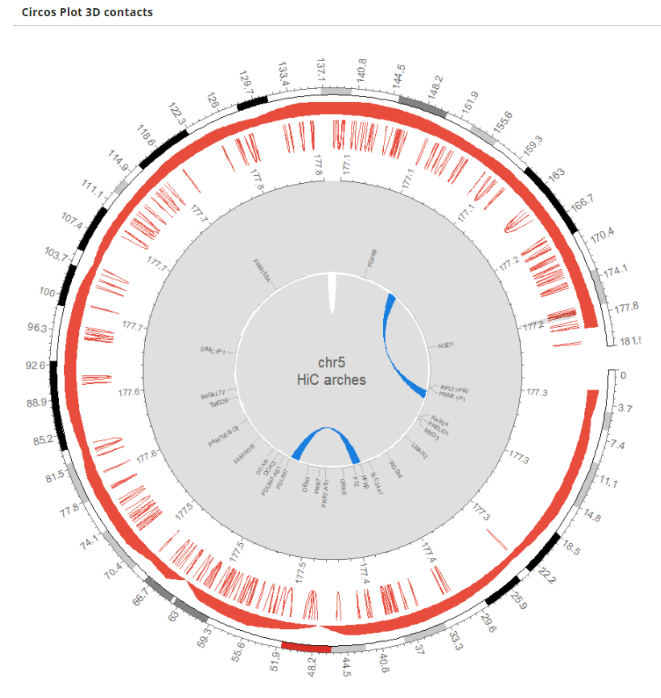

5. ***Categorical classification chart***: A [circular
   packing](https://r-graph-gallery.com/circle-packing.html) plot which reports
   the abundance in percent of the features in the provided [Categorical
   BED](#categorical-bed) file for either the whole genome or, if any, the
   user-selected genomic range.  This plot consists in a series of circles whose
   radius is proportional to the amount of elements classified according to the
   reported categories. Circles are also organized hierarchically, allowing to
   evaluate different types of classifications in the same plot.  This is
   particularly useful when more than one categorical BED file is provided.

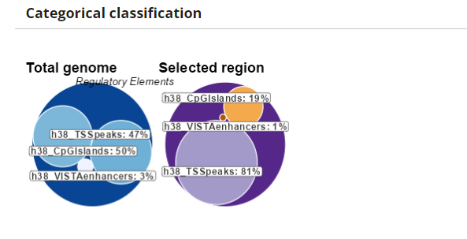

6. ***Manhattan plot***: A Manhattan plot showing an enlarged view of the
   chromosome relative to the user-selected region with the IDs of the
   significant SNPs (-log(p-value) > 10<sup>-8</sup>). If the selected region
   is smaller than the entire chromosome, a zoom-in of the region with the IDs
   of the significantly associated SNPs is displayed. This allows evaluation of
   the features in the selected regions within the context of the surrounding
   genomic elements, e.g. understanding if the selected region is within or
   close to a hotspot.

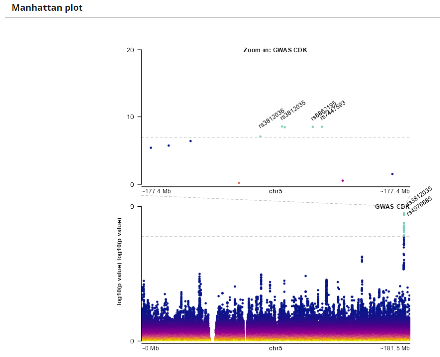

Currently, these plots cannot be exported.

</details>
</div>

<div>
<details open>
<summary>Run and Export Functionalities</summary>

### Run and Export Functionalities

With ***Genomic Viewer*** it is possible to explore multiple datasets and
export a high quality image of the created visualization.

For all these operations there are three key buttons in the ***Genomic
Viewer*** interface:

- *Go* button is used to generate or update the main genomic view plot with a
  new set of user-defined parameters. The *Go* button is placed at the bottom
  of the left sidebar beside the *Save* button.


- *Save* button: once the user is satisfied with the displayed genomic view
  plot, it can be exported in the desired file format through the *Save*
  button, which will open a pop-up window. A files can be saved in either of
  the formats: SVG, PDF, PNG, or JPG.

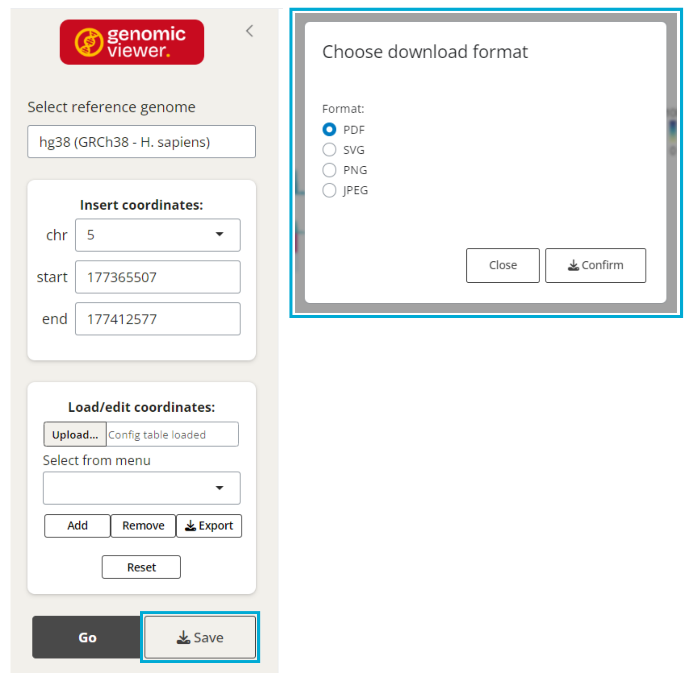

- *Data download* buttons: the tables with raw data subset to the user-selected
  genomic range can be exported for external use from the *Data* navigation
  tab.  Below each table overview there is a *Download* button which exports
  the file in the correct format appending to the file name the corresponding
  coordinates.

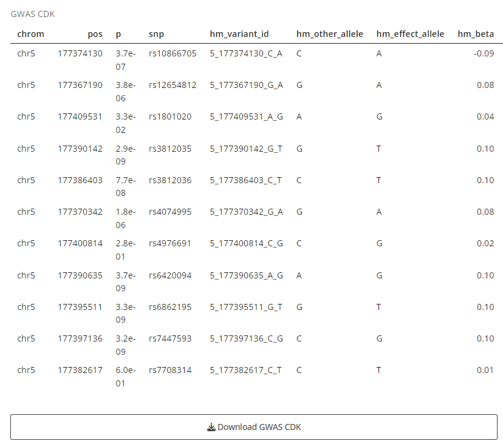

</details>
</div>

------------------------------------------------------------------------

## 4. Tutorial

<div>
<details open>
<summary>&nbsp;</summary>

This section contains a tutorial explaining how to use ***Genomic Viewer***
through a practical example with real data.

In this tutorial you will learn how to:
- Correctly set navigation parameters to visualize genomic tracks;
- Navigate the genome;
- Generate and interpret a plot with different genomic data tracks;
- Export a subset of the raw data;
- Evaluate data based on the stats;
- Employ the obtained information to design further experiments/analyses.

### Loading usage example data

The first step to run a ***Genomic Viewer*** session is to set up the 
[*configuration file*](#configuration). This is used to specify which files to 
upload. The data used in this tutorial are made available during [***Genomic 
Viewer*** installation](#installation) together with a ready-to-use 
configuration file. In this example we are analyzing publicly available data 
from the *Human Kidney cortex* and *Chronic Kidney Disease (CKD)* publications.  

*Note:* The dataset is limited to
chromosome 5 to keep the installation lean. The whole datasets are specified in
[References and Links](#references-links) and can be downloaded from there,
placed in the `./data` folder and visualized after updating the configuration 
file with the correct file paths and labels.

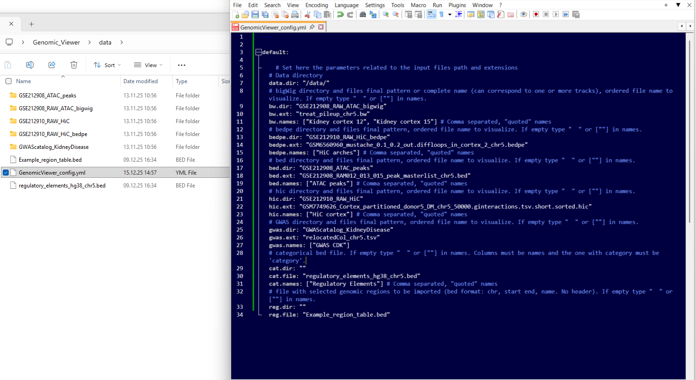

### Biological question

In this tutorial we are going to inspect a GWA study investigating human
CKD with the aim to identify putative clinically 
relevant risk loci. One way to select relevant genetic variants identified by 
GWAS is by checking if they fall within genomically active genes or regulatory 
elements. Therefore we are integrating GWAS with open chromatin profiling (ATAC-seq), 
3D chromatin interactions (HiC) and regulatory elements annotations.

This analysis should be considered as an explorative test to suggest the user 
for additional analytic or experimental validations.

### Genome selection, navigation and plot inspection

Before starting to inspect the data tracks we have to select the correct
reference genome. When ***Genomic Viewer*** is started it loads by default the
human reference genome hg19 (GRCh37). However, the example data are mapped to
the human reference genome hg38 (GRCh38). Therefore, we first select the
appropriate reference genome from the dropdown menu in the left sidebar.


The example dataset contains the full chromosome 5, so we can visualize it by
clicking on the respective chromosome in the *Choose chromosome* interactive
graphics in the upper right sidebar.


Clicking on chromosome 5 passes the coordinates to the *Load coordinates* panel
on the left sidebar. Make sure that the *Plot* navigation tab is selected in the
main central window. Next, click the *Go* button to generate the genomic plot.

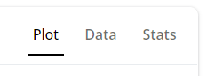

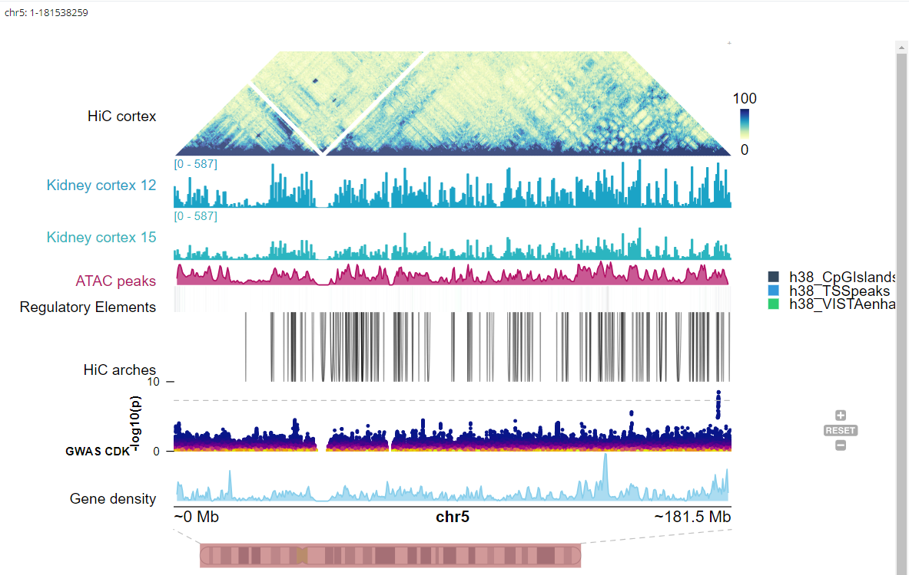
     **Figure 4.1** 

In the Manhattan plot, we notice a pileup of significant SNPs close to the right
chromosome end. We want to look in more detail at this region, so we use the
*drag and drop zoom bar* at the bottom of the plot. For quick access, we have
already preloaded these coordinates as a custom coordinates list. This is
accessed via the *Load Coordinates* panel in the left sidebar. By clicking on
the first entry in the list, the corresponding coordinates (relative to the gene
*SLC34A1*) are passed to the tool and the *Insert Coordinates* panel will
automatically update.

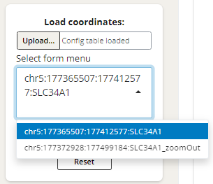

Again, make sure that the *Plot* navigation tab is selected in the main central
window. Next, click the *Go* button to render the visualization. Feel free to
play with the different zoom options (either on the location bar or with the
zoom buttons). The new visualization range can be saved by pressing the *Add*
button.

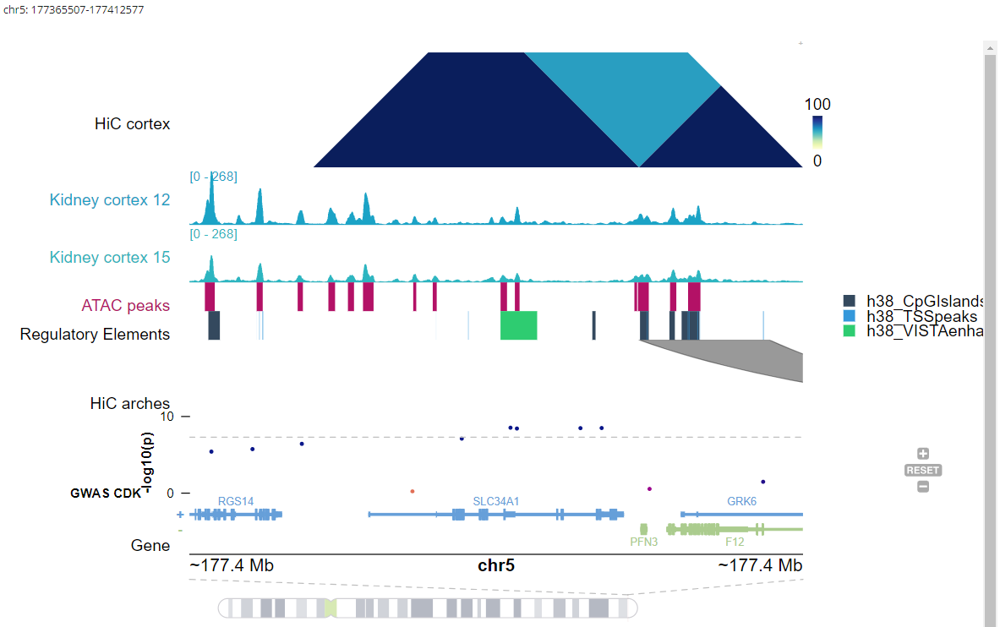
     **Figure 4.2** 

In the enlarged visualization focusing on *SLC34A1*, we note the presence of
some epigenetic features, like regulatory elements, ATAC-seq
peaks and the proximity to a 3D chromatin loop (HiC arch). The most evident 
feature is the presence of an enhancer region inside of the SLC34A1 gene (marked in
green) that overlaps with significant SNPs. Enhancers located inside genes can 
act in place of a typical promoters for a specific isoform initiating 
transcription itself or influencing splicing (Maqbool et al. 2020)[[2]](#ref2). 
Despite not being a sufficient validation, if this is true for *SLC34A1* gene 
we expect that the enhancer overlaps with the TSS of a shorter isoform. 
With ***Genomic Viewer*** we can inspect transcript isoforms by checking the 
*Expand transcripts* box in the right sidebar, which will automatically trigger 
the visualization of all isoforms.

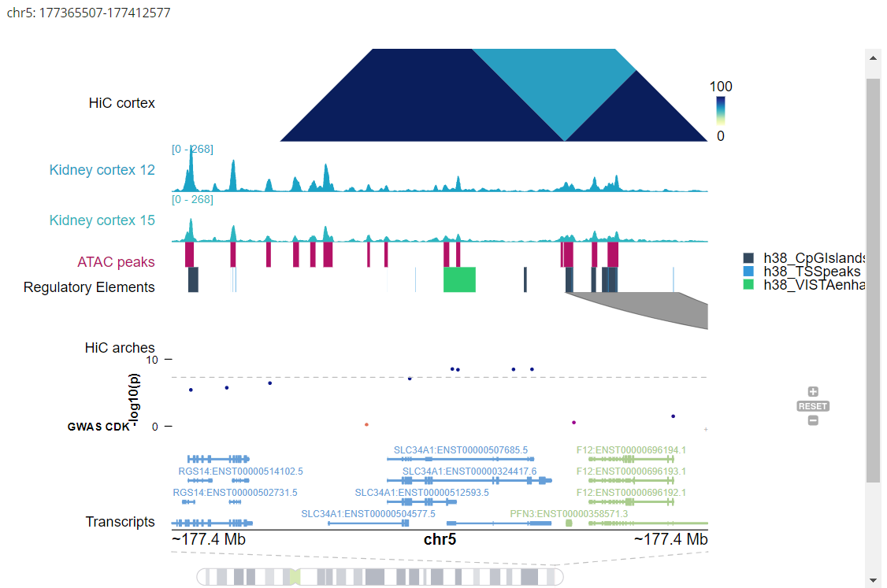
     **Figure 4.3** 

As we can see from the resulting plot, the hypothesis of this enhancer to work 
as internal promoter is compatible with the presence of a short *SLC34A1* isoform 
transcribed from there and its functionality is supported by the overlapping with
open chromatin, as reported by the ATAC-seq peaks and profile tracks (Kidney 
cortex 12 and 15).

An additional feature that can be observed is the presence of a chromatin loop 
(grey HiC arch) starting from the right flanking region of the visualized locus.
As before, you can use the *drag and drop zoom bar* or *zoom buttons* to extend 
the visualized window until the rightmost anchor of the loop and until additional 
loops on the left side of *SLC34A1* are displayed. Also in this case we saved
for you the coordinates for a quick access. To select them, click the second entry
in the *Load coordinates* drop down menu.

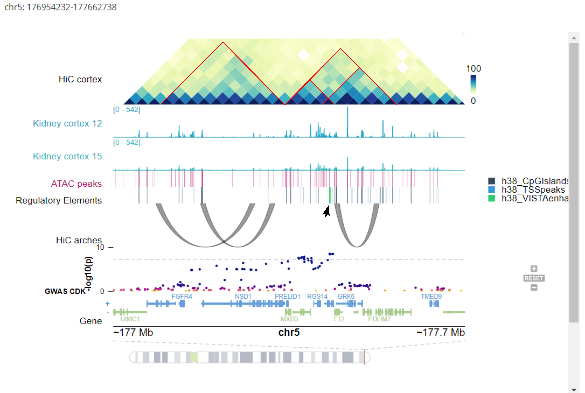
     **Figure 4.4** 

After pressing the *Go* button, the resulting plot shows that the *SLC34A1* gene 
and the enhancer we are evaluating (black arrow in the image above) are located 
within the same topologically associated domain (TAD) and between different 
sub-TADs (red triangles in HiC heatmap). This observation suggests that more genes 
within the TAD might be regulated by this enhancer under analysis (black arrow).

Together, the observations retrieved through the use of ***Genomic Viewer*** 
suggest that the identified SNPs, by affecting a regulatory element, 
could potentially cause alterations in multiple genes inside the locus besides 
*SLC34A1*. Further testing of this hypothesis is outside the aim of the present 
tutorial but serve as an example of how ***Genomic Viewer*** can support the user
in hypothesis formulation and experimental design.


### Download of the genomic view plot

A snapshot of the currently displayed visualization can be downloaded by pressing
the *Save* button in the bottom left sidebar. This will open a popup window offering
different file formats to save the image: SVG, PDF, PNG and JPG. See *Export
Functionalities* in the [Features and Usage](#features-and-usage) section.


### Export raw data subsets

In addition to plotting genomic tracks, ***Genomic Viewer*** offers the
possibility to investigate the input data more deeply. This is done in the
*Data* tab of the central window.

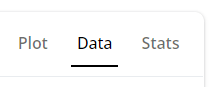

From here you can export the raw data, limited to the region that you selected
from the genome navigation options. In the working example the region is the
one corresponding to *SLC34A1* gene (chr5: 177365507-177412577) and this option is
useful to:

- Extract the dbSNP IDs and the alternative DNA bases in the two SNPs alleles
  from the GWAS table;
  
- Export the coordinates and IDs of regulatory elements category and ATAC-peaks
  that are found in the risk locus.

The tables can be inspected in the application interface preview or downloaded
from the *Download* button below each table.


For example, we can see that the 4 SNPs above the significance threshold have the
following IDs: rs3812035, rs6420094, rs6862195, rs7447593. With these IDs, we
can interrogate the literature and databases for reported information on their 
effect on gene product integrity, CKD or other pathologies. According to a  
[dbSNP](https://www.ncbi.nlm.nih.gov/snp/) search, all the relevant SNPs have
functional consequences that do not affect the coding sequence, reinforcing the
hypothesis of a potential regulatory elements-mediated effect. Of note, the 
rs6420094 was already observed in association with diabetic kidney disease (DKD) 
(Zhang et al 2023)[[4]](#ref4), while there is still no report for the others.  
<!-- Well, this is like the carrot in front of the mule. What's up now with
these SNPs? Dive in, we want to tell a story! Where are they exactly located.
Are they even changing the codeing sequence? -->

On the other hand, having access to the exact coordinates of peaks and regulatory
elements allows to gather details on the corresponding sequence, investigate the 
presence of transcription factor binding motifs or design PCR primers or gRNAs
for experimental testing.

Deepening these aspects is out of the aim of this tutorial, but provides an example 
on how to exploit ***Genomic Viewer***-derived information for further biological 
exploration.

<!-- How? You owe the reader what he might do from here on. -->


### Evaluation of data (Stats tab)

***Genomic Viewer*** also offers some dataset-specific plots accessible from the
*Stats* tab.

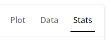

Each of these plot can be generated by clicking the *Run* button in the
corresponding section.  Since our example include all the data types associated
to a *Stats* plot you can try to generate all of them. For a detailed description
of the single plots you can refer to the *Analysis Tools* in the [Features and
Usage](#features-and-usage) section.

Here, we are going to concentrate on the aspects that are more related to our
biological question:

- The Manhattan plot shows a putative risk locus with a cluster of significantly
  associated SNPs in the right telomere proximal region of chromosome
  5. A zoom-in of this region is useful to visually report the dbSNP IDs of the
  significant SNPs as an alternative to the table generated in the *Data* tab.

- From the zoomed genomic screen comprising the risk locus we noticed the
  presence of several regulatory elements. The categorical classification chart
  is useful to evaluate their enrichment compared to their abundance in the
  whole genome. For instance, the locus of interest is rich in TSS peaks
  resembling gene promoters. An altered DNA sequence can have crucial effects on
  transcription regulation when occurring in regulatory regions like promoters
  or enhancers.

- The peak counts and overlap plots shows that the percentage enrichment in open 
  chromatin regions (ATAC-seq peaks) and 3D chromatin interactions (HiC arches), 
  is comparable to that observed in the whole genome suggesting the importance of
  the epigenetic regulation of this locus, which would have been underrepresented 
  in such elements otherwise.


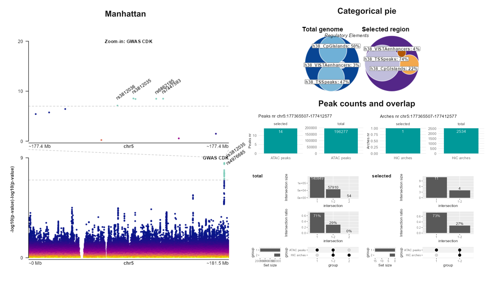


### Biological interpretation

***Genomic Viewer*** combines interactive visual inspection of genomic data with
basic analytical features. By enabling comparison across datasets and
conditions, the tool helps to identify patterns, trends, and regions of
interest facilitating biological interpretation and hypothesis building.

In this example we investigated public data from the human kidney cortex and
from patients with CKD to identify single nucleotide variants that may impact
renal health. Looking at the Manhattan plot from a CKD GWA study on chromosome 5,
revealed a locus of interest with signifcantly associated SNPs. A more detailed 
investigation of this region indicates that at least 6 of the most significant 
SNPs fall inside the *SLC34A1* gene. Of these, one was already reported in 
association with DKD (Zhang et al 2023)[[4]](#ref4)<!-- Please also consider/discuss the fact that SNP
proximity is not sufficient to causality! Clearly, this gene is the best
candidate by function.  How many other genes we have there within a reasonable
distance? And repeat what you have found about the SNPs in the previous section,
where I have asked for more information. --> This gene encodes for a
renal‐specific sodium–phosphate cotransporter responsible for the readsorption
of filtered sodium and phosphate and is expressed in the proximal tubule within
the renal cortex (Fearn et al.  2018)[[3]](#ref3). The clinical relevance of
*SLC34A1* is supported by recent literature reporting its downregulation in
acute kidney injury (Wilflingseder et al.)[[5]](#ref5). However SNPs proximity is 
not sufficient to infer causality, thus we integrated epigenetic data from healthy
individuals to obtain further cues on functional aspects of the locus. 
These data revealed that *SLC34A1* is in an open chromatin region, as demonstrated 
from the overlap with ATAC-seq profiles and annotated peaks (Kidney cortex 12 
and 15, ATAC peaks tracks) which also contains several regulatory elements. 
In particular, there is an overlap between the SNPs of interest and an enhancer 
element (Regulatory elements track, green) which from has a localization 
compatible for acting as internal promoter for a shorter *SLC34A1* isoform (see 
the expanded isoform example image). Enhancer elements can potentially regulate 
several targets, indeed HiC data (HiC cortex matrix and HiC archs) show that 
despite the enhancer of interest is not annotated as an anchor for high 
frequency contacts (HiC archs vertex) is within the same TAD or sub-TAD, being 
potentially interacting with multiple other genes. Knowing this is important to 
still consider other genes to be affected by the identified SNPs. Validating all 
the target genes that interact with the enhancer requires specificexperimental 
designs, like enhancer sequence mutagenesis or CRISPRi followed by RT-qPCR or 
RNAseq.<!-- Again, what are the distal elements, do they
have any connection with CKD? How can we make use of this finding? What would be
possible further steps? (And why haven't they been described here?) -->
Altogether, these observations indicate that the SNPs in the *SLC34A1* locus may 
alter the function of epigenetic regulatory elements, which in turn can affect 
the expression of the gene. The latter hypothesis can be demonstrated upon the 
comparison of expression data (either RT-qPCR or RNA-seq) from individuals 
affected by the SNPs or healthy. Unfortunately we do not have access to these data.

<!-- So far, I am not convinced. You have listed a
couple of features near the SNPs, but how close are they? Would it be enough to
hypothetize that the SNPs are tagging changes in the regulatory elements? -->
This hypothesis can be experimentally tested or addressed by integration of
further genomic tracks, like RNA-seq or ChIP-seq. <!-- Well, the first is lab
work. Ok. But the second we could also do. Why don't we have these data then
already in the example dataset? And please finish this paragraph with a concrete
message, dont' leave stuff open here. -->

<!-- Please add a paragraph on limitations. Not excuses why data are not in the
example or why you did not further dig into some follow-up worthy idea :-) Real
limitations. What can be improved in the app? -->
In summary, this tutorial illustrates how to use ***Genomic Viewer*** through a 
complete exploratory workflow —from genome navigation to data export and 
interpretation— using to integrate genetic and epigenetic datasets to move from 
raw association signals to biologically informed hypotheses and providing a 
practical starting point for downstream analytical or experimental validation.

</details>
</div>

------------------------------------------------------------------------

## 5. Limitations

<div>
<details open>
<summary>&nbsp;</summary>

While ***Genomic Viewer*** enables integrated visual exploration of heterogeneous
genomic datasets, several limitations should be considered, both in terms of
biological interpretation and technical functionality. First, the analyses
supported by the application are inherently exploratory: spatial proximity
between SNPs, regulatory elements, and genes does not establish causality, and
the tool does not perform statistical fine-mapping, variant effect prediction,
or causal inference. Regulatory interactions inferred from HiC data are further
constrained by resolution, normalization choices, and dataset specificity, and
may not capture condition- or disease-specific chromatin states.

From a technical perspective, Genomic Viewer is primarily designed for
visualization and lightweight data inspection rather than large-scale or fully
customizable analyses. The application does not modify, preprocess, or normalize
input files, and assumes that all datasets are already harmonized with respect
to genome build, coordinate system, and formatting. Interactive actions are
restricted to predefined navigation, filtering, and export options; users
cannot directly edit tracks, dynamically change file assignments, or execute
custom computations within the interface.

In addition, graphical customization is intentionally limited. Some visual
parameters—such as color assignment for tracks—are automatically determined by
the application and cannot be explicitly controlled by the user. Certain
graphical actions provide alternative representations (e.g. different plot
styles for a given data type), but these changes are applied globally to all
loaded files of the same format, preventing mixed visualization outputs within
a single track category. Performance and scalability further depend on
client-side rendering and input file size, which may limit the number of tracks
or the genomic window that can be explored smoothly in a single session.

Finally, ***Genomic Viewer*** currently supports a restricted set of reference
genomes, with built-in annotations available for human and mouse only. While the
underlying design allows extension to additional organisms, such support is not
yet implemented in the current release.

Despite these limitations, Genomic Viewer is intended as a
hypothesis-generation platform that helps users prioritize loci, variants, and
regulatory elements, providing a structured starting point for downstream
computational analyses or targeted experimental validation using specialized
tools.

</details>
</div>

------------------------------------------------------------------------

## 6. Getting Help

<div>
<details open>
<summary>&nbsp;</summary>

For general support questions, reporting a bug or suggesting a new feature you
can create an issue in our [Github
repository](https://github.com/EuracBiomedicalResearch/genomic_viewer).

For confidential reports, please contact [the
maintainer](mailto:sara.lago@eurac.edu) by email.

</details>
</div>

------------------------------------------------------------------------

## 7. References and Links
<div>
<details open>
<summary>&nbsp;</summary>

### Data Availability

All data in this tutorial are publicly available from
[GEO](https://www.ncbi.nlm.nih.gov/geo/), the [GWAS
catalog](https://www.ebi.ac.uk/gwas/) and
[ENCODE](https://www.encodeproject.org/) under the following accession numbers:

- HiC (GEO GSE212910)
- ATAC-seq (GEO GSE212908)
- CKD GWAS (GWAS Catalog 26831199)
- H3K27ac bam (ENCODE ENCFF119WEO)

Regulatory elements were downloaded from [UCSC Table
Browser](https://genome.ucsc.edu/cgi-bin/hgTables).

Additional cytoband information was retrieved from:

- CHM13 (T2T): [marbl/CHM13 GitHub repo](https://github.com/marbl/CHM13)
- GRCM39 (mm29): [UCSC GoldenPath](https://hgdownload.soe.ucsc.edu/goldenPath/mm39/database/)

### Literature

*1.*<a id="ref1"></a> Kramer NE, Davis ES, Wenger CD et al. Plotgardener:
cultivating precise multi-panel figures in R. Bioinformatics 2022;38:2042–5.

*2.*<a id="ref2"></a> Maqbool MA, Pioger L, El Aabidine AZ et al. Alternative 
Enhancer Usage and Targeted Polycomb Marking Hallmark Promoter Choice during T 
Cell Differentiation. Cell Reports 2020;32:108048.

*3.*<a id="ref3"></a> Fearn A, Allison B, Rice SJ et al. Clinical, biochemical,
and pathophysiological analysis of SLC34A1 mutations. Physiol Rep 2018;6:e13715.

*4.*<a id="ref4"></a> Liu Y, Chen Y, Yang Q et al. Single nucleotide polymorphisms 
in the GFR-related gene and the SNP-SNP interactions on the risk of diabetic 
kidney disease in Chinese Han population. Acta Diabetol 2023;60:115–25.</a>

*5.*<a id="ref5"></a> Wilflingseder J, Willi M, Lee HK et al. Enhancer and
super-enhancer dynamics in repair after ischemic acute kidney injury. Nat Commun
2020;11:3383.

</details>
</div>
------------------------------------------------------------------------

